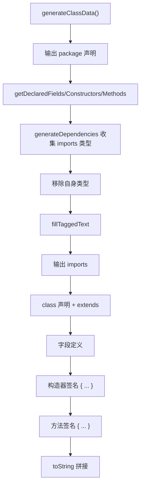

# 🧩 Reflector

<Badge type="tip" text="Android 子系统" /> <Badge type="info" text="反射 stub 生成器" />

> 经 Java 反射将 Class 重建为类 Java 源码文本：依次输出 package、imports、class 声明、字段、构造器、方法签名，复刻 JAD 风格 stub。

📁 源码：<code>ClassySharkAndroid/app/src/main/java/com/google/classysharkandroid/reflector/Reflector.java</code> &nbsp; 📦 包：<code>com.google.classysharkandroid.reflector</code>

## 职责

`Reflector` 经 Java 反射把一个 `Class` 重建为类 Java 源码文本（stub）。`generateClassData` 依次输出：package 声明、imports（`generateDependencies` 从字段/构造器/方法参数类型收集依赖类型到 `Hashtable`）、class 声明（含 extends）、字段定义、构造器签名、方法签名（方法体一律 `{ ... }`）。`TaggedWord` + `TAG` 枚举（`MODIFIER`/`IDENTIFIER`/`DOCUMENT`）为每个输出词打标注，预留语法高亮。`toString` 拼接所有 `TaggedWord.text`。类型翻译委托 `ClassTypeAlgorithm`。复刻 JAD 风格 stub 反编译。

## 关键方法 / 字段

| 名称 | 类型 | 说明 |
|------|------|------|
| `clazz` | private Class | 被反射的类 |
| `words` | private List&lt;TaggedWord&gt; | 输出词序列 |
| `TAG` | enum | MODIFIER / IDENTIFIER / DOCUMENT |
| `TaggedWord` | 内部静态类 | text + tag |
| `generateClassData()` | void | 反射生成 stub 文本 |
| `generateDependencies(...)` | private Hashtable | 收集依赖类型 |
| `fillTaggedText(...)` | private void | 输出 imports/类/字段/构造器/方法 |
| `toString()` | String | 拼接所有 word.text |
| `main(String[])` | static void | 自测：反射 Integer |

## 工作流程

## 设计要点

- 🪞 **反射式 stub 生成** — 不反编译字节码，而是经反射 API 重建方法签名（无方法体），JAD 风格。
- 🏷️ **TaggedWord 标注** — 每词带 MODIFIER/IDENTIFIER/DOCUMENT 标签，预留前端语法高亮染色。
- 📦 **imports 自动收集** — 从字段/构造器/方法参数/返回/异常类型收集依赖，移除自身，生成 import 列表。
- 🔗 **类型翻译委托** — JNI 风格类型名经 [[ClassTypeAlgorithm]] 转 Java 源码形式。
- 🧪 **内置 main 自测** — `main` 反射 `Integer.class` 打印 stub。

## 协作关系

- 依赖：[[ClassTypeAlgorithm]]（类型翻译）
- 被调用：[[ClassesListActivity]]（点击类名后生成 dump）

## 已知问题 / TODO

- 源码含多个 TODO：ENUMS 成员未处理、方法异常类型未加入 dependencies/imports。
- 使用原始 `Hashtable` 与 `Vector` 风格（`Class cc[]` 等旧式数组声明），非泛型，类型不安全。
- `generateDependencies` 中 `x = ClassTypeAlgorithm.TypeName(...)` 的赋值结果 `x` 未使用（疑似遗留）。
- 方法体恒为 `{ ... }`，无实际实现。

## 相关文档

- [Android 子系统架构](/reference/architecture/android)
