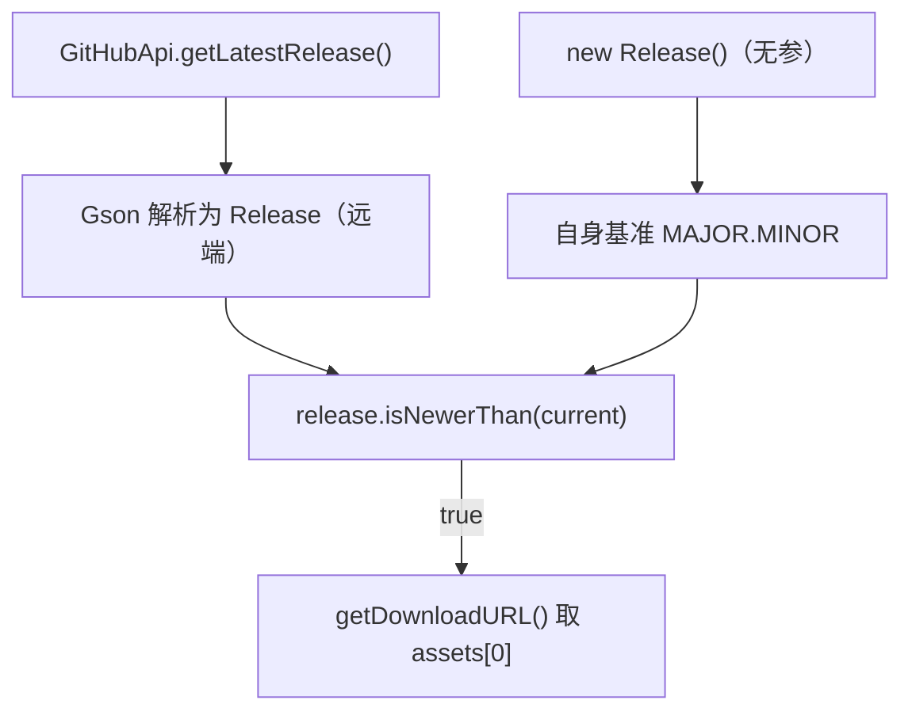

# 🧩 Release

<Badge type="tip" text="更新子系统" /> <Badge type="info" text="Gson 数据模型" />

> GitHub latest release 的 Gson 模型：既是远端响应解析对象，无参构造时又作版本比较基准——双重角色。

📁 源码：<code>ClassySharkWS/src/com/google/classyshark/updater/models/Release.java</code> &nbsp; 📦 包：<code>com.google.classyshark.updater.models</code>

## 职责

`Release` 表示 GitHub `/releases/latest` 接口返回的 release 数据，用 Gson 的 `@SerializedName` 把 JSON 字段映射到 Java 字段（`prerelease`、`created_at`、assets 中的 `browser_download_url`）。它只保留需要用的字段。`isNewerThan(Release)` 按 major.minor 数值比较判断远端是否更新。`getDownloadURL` 取 `assets[0]` 的下载地址。无参构造 `Release()` 用当前 `Version` 构造一个"自身版本"实例作为比较基准——故 Release 兼任远端响应模型与本地基准两个角色。

## 关键方法 / 字段

| 名称 | 类型 | 说明 |
|------|------|------|
| `name` | private final String | release 名（含版本号） |
| `preRelease` | private final boolean | `@SerializedName("prerelease")` |
| `body` | private final String | changelog 正文 |
| `assets` | private final ReleaseDownloadData[] | 附件数组 |
| `createdAt` | private final String | `@SerializedName("created_at")` |
| `Release()` | 无参构造 | 用 `Version.MAJOR.MINOR` 构造自身基准 |
| `isNewerThan(Release)` | boolean | major.minor 数值比较 |
| `getDownloadURL()` | String | 取 `assets[0].getURL()`，空返 null |
| `getMajorVersion()` / `getMinorVersion()` | private int | 解析 name 中的版本段 |
| `getChangelog()` / `getReleaseName()` / `getCreatedAt()` / `isPreRelease()` | getter | 字段访问 |

## 工作流程

## 设计要点

- 🎭 **双重角色** — 同一类既是远端响应模型，无参构造时又作本地版本基准。
- 🔢 **版本数值比较** — `isNewerThan` 拆 name 按 `.` 取 major/minor 转 int 比较，仅支持两段版本。
- 🏷️ **Gson `@SerializedName`** — 只映射需要的字段（prerelease、created_at），忽略响应其余部分。
- 📦 **assets 委托** — 下载 URL 藏在 `ReleaseDownloadData`，`getDownloadURL` 取首个 asset。
- 🔒 **全 final 字段** — 解析后不可变。

## 协作关系

- 依赖：[[Version]]（基准版本）、[[ReleaseDownloadData]]（assets 元素）、[[GitHubApi]]（响应类型）
- 被调用：[[AbstractDownloader]]（比较与下载）

## 已知问题 / TODO

- 源码注释提到 `preRelease` 字段"目前未使用，未来可能用于仅更新到稳定版"。
- 版本比较仅 major.minor 两段，无 patch；name 格式异常时 `getVersionField` 会抛 `NumberFormatException`。
- `equals` 仅比 `name`，`getDownloadURL` 仅取 `assets[0]`，假设 release 恰好一个 asset。

## 相关文档

- [更新子系统架构](/reference/architecture/updater)
