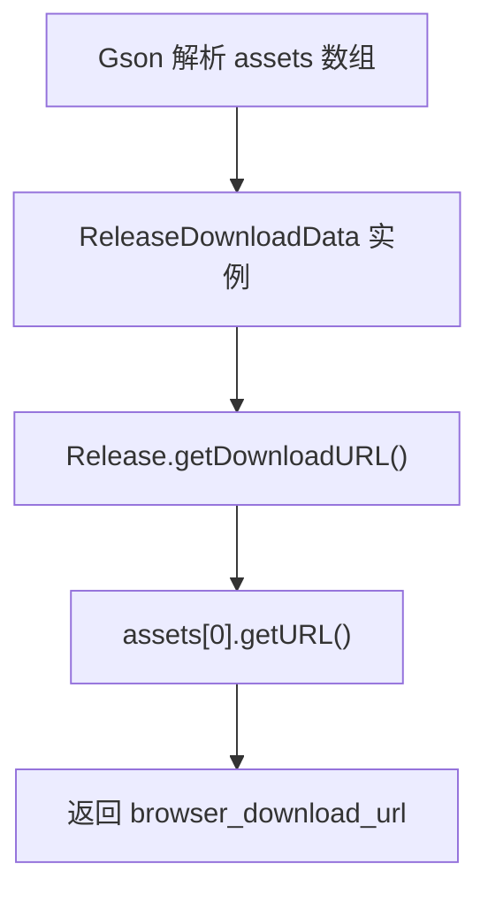

# 🧩 ReleaseDownloadData

<Badge type="tip" text="更新子系统" /> <Badge type="info" text="Gson 数据模型" />

> release asset 的包级私有模型：仅持 `browser_download_url`，可见性限制在模型层内部。

📁 源码：<code>ClassySharkWS/src/com/google/classyshark/updater/models/ReleaseDownloadData.java</code> &nbsp; 📦 包：<code>com.google.classyshark.updater.models</code>

## 职责

`ReleaseDownloadData` 表示 GitHub release 的一个 asset，用 `@SerializedName("browser_download_url")` 映射下载地址字段。它是包级私有类（无 `public`），仅持一个 `browserDownloadUrl` 字符串，通过包级 `getURL()` 暴露给同包的 `Release`。可见性刻意限制——该模型只服务于模型层内部，不对外暴露。

## 关键方法 / 字段

| 名称 | 类型 | 说明 |
|------|------|------|
| `browserDownloadUrl` | private final String | `@SerializedName("browser_download_url")` |
| `ReleaseDownloadData(String)` | 构造器 | 包级私有 |
| `getURL()` | String | 包级私有，返回下载地址 |
| `equals` / `hashCode` | override | 按 url 判等 |

## 工作流程

## 设计要点

- 🔒 **包级私有可见** — 类与 `getURL` 均无 `public`，仅模型包内可用，隐藏实现细节。
- 🏷️ **Gson 映射** — `@SerializedName` 把 JSON 的 `browser_download_url` 映射到 Java 驼峰字段。
- 🪶 **单字段模型** — 只持下载地址，其余 asset 字段忽略。
- ⚖️ **值对象语义** — 重写 `equals`/`hashCode` 按 url 判等。

## 协作关系

- 依赖：无
- 被调用：[[Release]]（assets 数组元素，`getDownloadURL` 取其 url）

## 已知问题 / TODO

- 无明显已知问题（极简单字段模型）。

## 相关文档

- [更新子系统架构](/reference/architecture/updater)
