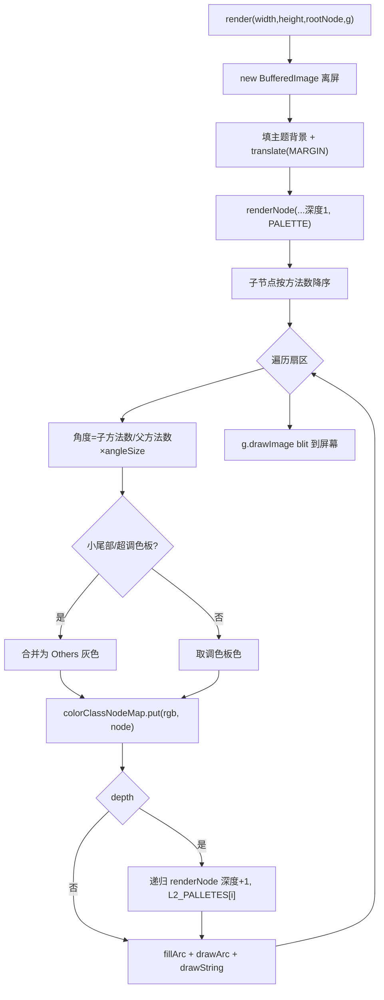

# 🧩 RingChart

<Badge type="tip" text="GUI 图表层" /> <Badge type="info" text="离屏渲染" />

> 基于 BufferedImage 的旭日图/多级环形图，可视化方法计数树。

📁 源码：<code>ClassySharkWS/src/com/google/classyshark/gui/panel/chart/RingChart.java</code> &nbsp; 📦 包：<code>com.google.classyshark.gui.panel.chart</code>

## 职责

`RingChart` 把方法计数树（`ClassNode`）渲染成多级环形图。每环段大小与子节点相对方法计数成比例，降序排列，小尾部合并为「Others」。它先离屏渲染到 `BufferedImage` 再 blit 到目标 Graphics，并通过颜色→节点的反向映射实现命中检测。默认最大深度 2，使用两层调色板。

## 关键方法 / 字段

| 名称 | 类型 | 说明 |
|------|------|------|
| `DEFAULT_MAX_DEPTH` | static int | 默认最大深度 2 |
| `PALETTE` | static Color[] | 顶级 9 色调色板 |
| `L2_PALLETES` | static Color[][] | 每父色 7 色变体供深度 2 |
| `colorClassNodeMap` | Map&lt;Integer,ClassNode&gt; | RGB→节点反向映射 |
| `selectedNode` | ClassNode | 当前高亮节点 |
| `render(width,height,rootNode,g)` | void | 离屏绘制后 blit |
| `renderNode(...)` | private void | 按深度递归选调色板绘制扇区 |
| `getClassNodeAt(x,y)` | ClassNode | 读 RGB 反查映射 |
| `getHighlightColor(Color)` | private Color | 选中节点 HSB 饱和度×0.7 调暗 |
| `setSelectedNode(ClassNode)` | void | 设高亮节点 |

## 工作流程

## 设计要点

- 🎨 **两层调色板** — 顶级 9 色 `PALETTE`，每父色对应 7 色变体 `L2_PALLETES`，保证深度 2 的子扇区与父色色系一致。
- 🎯 **RGB 反查命中** — 命中检测无需几何计算：扇区填充色作为 key 写入 `colorClassNodeMap`，鼠标位置 `getRGB` 后直接 map 反查。
- 📉 **小尾部合并** — 当 `currentColor == pallete.length-1` 或剩余角度 `<5` 时合并为「Others」灰色，避免过多碎扇区。
- 🌑 **HSB 高亮** — 选中节点用 `RGBtoHSB` 把饱和度×0.7 调暗，视觉区分。
- 🖼️ **离屏渲染** — `BufferedImage` 先画好再 blit，命中检测也复用该 image 的像素。

## 协作关系

- 被使用 ← [[RingChartPanel]]
- 依赖 → [[GuiMode]]（主题背景色）
- 依赖 → `ClassNode`（方法计数树）

## 已知问题 / TODO

- 🐛 `getClassNodeAt` 不做边界检查，鼠标落在 image 范围外会 `getRGB` 抛 `ArrayIndexOutOfBoundsException`。
- 🐛 `OTHERS_COLOR` 灰色扇区不写入 `colorClassNodeMap`，悬停 Others 段无法命中工具提示。
- 🐛 mermaid 中多处笔误已避免；源码 `pallete` 拼写应为 `palette`（代码异味）。

## 相关文档

- [GUI 架构](/reference/architecture/gui-layer)
- [[RingChartPanel]]
