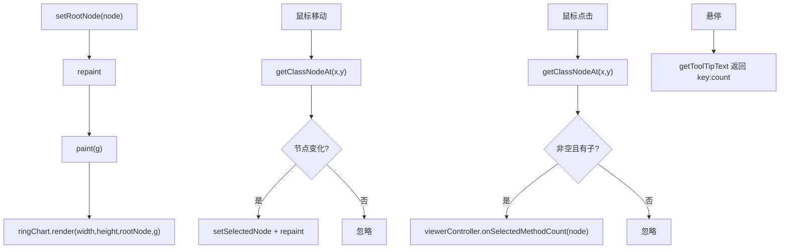

# 🧩 RingChartPanel

<Badge type="tip" text="GUI 图表层" /> <Badge type="info" text="桥接器" />

> JPanel 宿主 RingChart 并桥接鼠标事件实现节点选择与工具提示。

📁 源码：<code>ClassySharkWS/src/com/google/classyshark/gui/panel/chart/RingChartPanel.java</code> &nbsp; 📦 包：<code>com.google.classyshark.gui.panel.chart</code>

## 职责

`RingChartPanel` 是承载 `RingChart` 的 `JPanel`，桥接鼠标移动、点击与工具提示。鼠标移动时通过 `getClassNodeAt` 反查节点、设为高亮并重绘；点击非空子节点时回调 `ViewerController.onSelectedMethodCount`。它注册到 `ToolTipManager` 显示「key:methodCount」，并作为拖放目标注册 `FileTransferHandler`。

## 关键方法 / 字段

| 名称 | 类型 | 说明 |
|------|------|------|
| `ringChart` | RingChart | 内部图表实例 |
| `rootNode` | ClassNode | 当前根节点 |
| `paint(Graphics)` | void | 委派 `ringChart.render` |
| `setRootNode(ClassNode)` | void | 设根节点并重绘 |
| `getToolTipText(MouseEvent)` | String | 返回 `key:methodCount` |
| 鼠标移动监听 | 匿名 | 设 selectedNode 重绘 |
| 鼠标点击监听 | 匿名 | 非空子节点回调控制器 |

## 工作流程

## 设计要点

- 🖱️ **悬停重绘循环** — 鼠标移动检测节点变化，变化才 `repaint`，避免无谓重绘。
- 💬 **工具提示注册** — `ToolTipManager.sharedInstance().registerComponent(this)` 启用悬浮提示。
- 🎯 **点击仅推进非叶子** — 只有点击有子节点的节点才回调，避免点击叶子无意义。
- 📥 **拖放目标** — 构造时注册 `FileTransferHandler`，环形图区也可直接拖入存档。

## 协作关系

- 依赖 → [[RingChart]]、[[ViewerController]]、[[FileTransferHandler]]、[[GuiMode]]
- 被使用 ← [[ClassySharkPanel]]

## 已知问题 / TODO

- 🐛 `getToolTipText` 与移动监听都调 `getClassNodeAt`，未对 `image==null` 或越界做防护（依赖 RingChart 内部检查）。
- 🐛 `mouseEntered`/`mouseExited` 等空实现，留空方法略冗余。

## 相关文档

- [GUI 架构](/reference/architecture/gui-layer)
- [[RingChart]]
