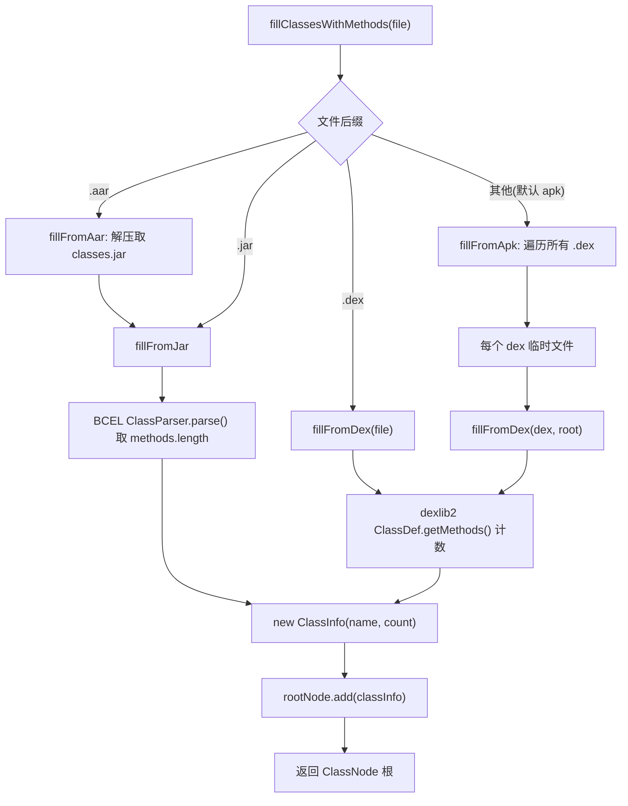

# 🧩 RootBuilder

<Badge type="tip" text="方法计数" /> <Badge type="info" text="模板方法" />

> 方法计数树的构建器，按文件后缀分发到 aar/jar/dex/apk 四条解析路径，产出一棵 `ClassNode`。

📁 源码：<code>ClassySharkWS/src/com/google/classyshark/silverghost/methodscounter/RootBuilder.java</code> &nbsp; 📦 包：<code>com.google.classyshark.silverghost.methodscounter</code>

## 职责

`RootBuilder` 是方法计数子系统的入口构建器。它接收一个归档文件（`.aar`/`.jar`/`.dex`/`.apk`），按后缀分发到对应的解析路径，提取每个类的方法数，包装成 `ClassInfo` 注入新建的 `ClassNode` 根，最终返回一棵完整的"按包聚合方法计数树"。它屏蔽了不同字节码格式（JVM `.class` vs Dalvik `.dex`）的解析差异。

## 关键方法 / 字段

| 名称 | 类型 | 说明 |
|------|------|------|
| `fillClassesWithMethods(File)` | ClassNode | 公开入口：按后缀分发 |
| `fillClassesWithMethods(String)` | ClassNode | 字符串路径重载，转 File 后委托 |
| `fillFromAar(File)` | private ClassNode | 解压 AAR 取内嵌 `classes.jar`，再委托 `fillFromJar` |
| `fillFromJar(File)` | private ClassNode | 用 BCEL `ClassParser` 遍历 `.class` 取方法数 |
| `fillFromDex(File)` | private ClassNode | 单 dex 入口：建根 + 委托重载 |
| `fillFromDex(File, ClassNode)` | private void | 用 dexlib2 遍历 `ClassDef.getMethods()` 计数 |
| `fillFromApk(File)` | private ClassNode | 解压 APK 所有 `.dex` 到临时文件，逐一 `fillFromDex` |
| `fillFromJayce(File)` | private ClassNode | Jayce 解析（未实现，含 TODO） |

## 工作流程

## 设计要点

- 🧭 **模板方法式分发** — `fillClassesWithMethods` 按 `endsWith` 做类型判定，委托到各 `fillFromXxx`；每条路径独立但产出同构的 `ClassNode`。
- 📦 **多格式适配** — JAR 走 JVM 字节码（BCEL `ClassParser`/`JavaClass`），DEX/APK 走 Dalvik 字节码（dexlib2 `DexFile`/`ClassDef`/`Method`），通过 `DexlibLoader` 统一加载。
- 🗃️ **临时文件解压** — AAR 先解出内嵌 jar 到临时文件再委托；APK 把每个 `.dex` 落地到临时文件再喂给 dexlib2（`deleteOnExit` 清理）。
- 🔡 **路径分隔归一** — DEX 类名用 `replaceAll("\\/", "\\.")` 把 `/` 分隔转 `.`，并 `substring(1, len-1)` 去掉首尾的 `L` 与 `;`（VM 类型描述符语法）。
- ⚠️ **静默吞异常** — `fillFromAar` 的 `catch(Exception e){}` 空块吞掉错误并返回空根节点，失败时输出为空树。

## 协作关系

- 产出 → [[ClassNode]]（构建并填充根节点）
- 使用 → [[ClassInfo]]（每个类包装成值对象）
- 调用 → [[DexlibLoader]]（`loadDexFile` 加载 DEX）
- 被调用 ← [[Exporter]]（`writeMethodCounts` 调 `fillClassesWithMethods`）

## 已知问题 / TODO

- 🚧 `fillFromJayce` 尚未实现，仅 `add(new ClassInfo("not ready", 1))` 占位，源码内 `// TODO threading need to wait till the content reader finishes` 标注等待 content reader 完成。
- 🤐 `fillFromAar` 异常被空 catch 静默吞掉，AAR 损坏时无任何错误提示。
- 🧹 临时文件依赖 `deleteOnExit`，进程异常退出时可能残留。

## 相关文档

- [方法计数子系统](/reference/architecture/methodscounter)
- [导出器](/reference/architecture/exporter)
- [内容读取层](/reference/architecture/content-reader)
