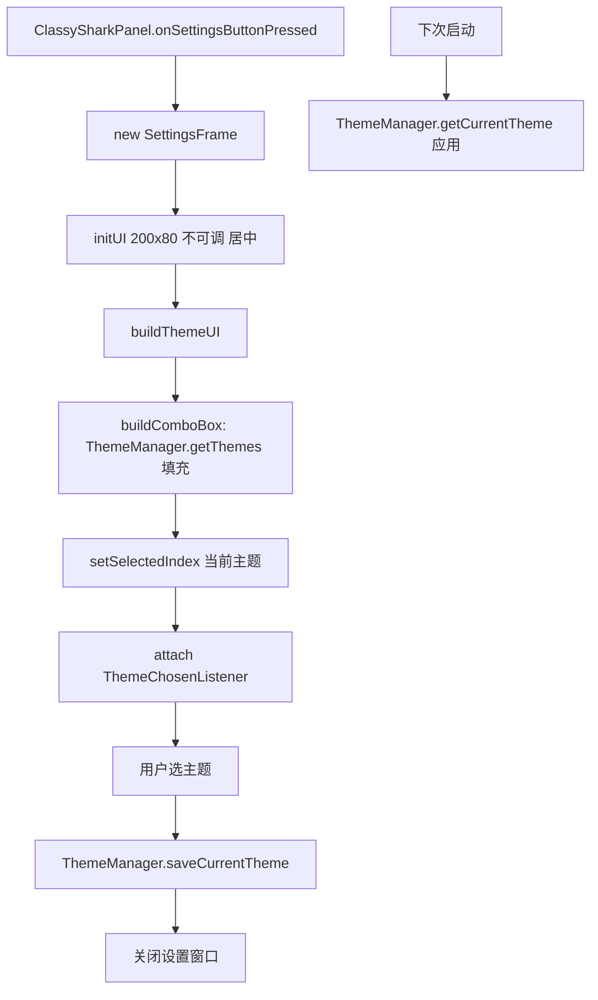

# 🧩 SettingsFrame

<Badge type="tip" text="GUI 设置层" /> <Badge type="info" text="模态窗口" />

> 小模态 JFrame 带主题选择 JComboBox，选择持久化供下次启动应用。

📁 源码：<code>ClassySharkWS/src/com/google/classyshark/gui/settings/SettingsFrame.java</code> &nbsp; 📦 包：<code>com.google.classyshark.gui.settings</code>

## 职责

`SettingsFrame` 是一个极简模态 `JFrame`（200x80，不可调大小），含一个主题选择 `JComboBox`。组合框从 `ThemeManager.getThemes()` 填充，选中当前主题索引，附加 `ThemeChosenListener`。标签提示「下次启动生效」——当前主题运行时不热切换，选择经 `ThemeManager.saveCurrentTheme` 持久化，下次启动经 `ThemeManager.getCurrentTheme` 读取应用。

## 关键方法 / 字段

| 名称 | 类型 | 说明 |
|------|------|------|
| `theme` | Theme | 缓存当前主题 |
| `themes` | String[] | 未使用的硬编码 `{"Light","Dark"}` 字段 |
| `buildThemeUI()` | private JPanel | 组装标签 + 组合框 |
| `buildComboBox()` | private JComboBox | 从 ThemeManager.getThemes 填充，设当前索引 |
| `buildThemeLabel()` | private JLabel | 提示「下次启动生效」 |
| `initUI()` | private void | 设大小/位置/不可调 |

## 工作流程

## 设计要点

- 🧩 **极简模态** — 仅 200x80，不可调整大小，专注主题选择一项任务。
- ⏳ **下次启动生效** — 运行时不热切换主题，选择持久化后下次启动应用，避免运行中重绘复杂。
- 📦 **委托 ThemeManager** — 主题列表、当前索引、保存都委托给 `ThemeManager`，本类仅做 UI。

## 协作关系

- 依赖 → [[ThemeManager]]、[[ThemeChosenListener]]、[[GuiMode]]
- 被实例化 ← [[ClassySharkPanel]]（`onSettingsButtonPressed`）

## 已知问题 / TODO

- 🐛 字段 `themes = {"Light","Dark"}` 硬编码且未使用，组合框实际从 `ThemeManager.getThemes()` 取，易误导。
- 🐛 标签 tooltip 为英文 "It will be applied the next time ClassyShark is started"，未国际化。
- 🐛 未设模态（`setModal`/模态父框），窗口非真正模态，可与主窗并存。

## 相关文档

- [GUI 架构](/reference/architecture/gui-layer)
- [[ThemeChosenListener]]
