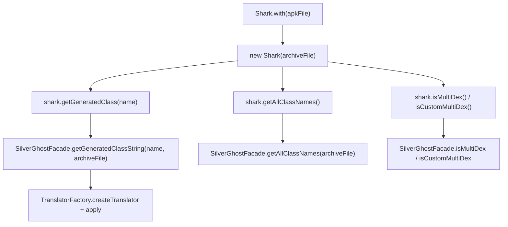

# 🧩 Shark

<Badge type="tip" text="silverghost 核心" /> <Badge type="info" text="建造者门面 + 委托" />

> 面向构建/CI 工具链的 ClassyShark API，以建造者风格封装 SilverGhostFacade 的静态能力。

📁 源码：<code>ClassySharkWS/src/com/google/classyshark/Shark.java</code> &nbsp; 📦 包：<code>com.google.classyshark</code>

## 职责

`Shark` 是面向构建与持续集成（build & CI）工具链的 ClassyShark API，类注释明确为「The ClassyShark API usually used by build & continues integration toolchains」。它以 `Shark.with(File)` 建造者入口绑定一个归档文件，随后所有查询方法都委托给 [[SilverGhostFacade]] 的对应静态方法，把「持有 archiveFile」的状态从调用方收敛到 Shark 实例内部，使 CI 脚本可以链式调用而无需反复传文件参数。

## 关键方法 / 字段

| 名称 | 类型 | 说明 |
|------|------|------|
| `archiveFile` | File | 构造时绑定的归档文件，所有委托方法都把它传给 Facade |
| `with(File)` | static Shark | 建造者入口，返回持有 archiveFile 的 Shark 实例 |
| `getGeneratedClass(String className)` | String | 委托 `SilverGhostFacade.getGeneratedClassString`，返回反编译文本 |
| `getAllClassNames()` | List&lt;String&gt; | 委托 Facade 列出全部类名 |
| `getManifest()` | String | 委托 Facade 获取 AndroidManifest.xml 文本 |
| `getAllMethods()` | List&lt;String&gt; | 委托 Facade 列出全部方法 |
| `getAllStrings()` | List&lt;String&gt; | 委托 Facade 列出全部字符串表 |
| `isMultiDex()` | boolean | 委托 Facade 判断是否标准 multidex |
| `isCustomMultiDex()` | boolean | 委托 Facade 判断是否自定义 multidex |
| `main(String[])` | static void | 演示用 main，硬编码一个 APK 路径逐项打印结果 |

## 工作流程

## 设计要点

- 🧩 **建造者风格 facade** — `with(File)` 是唯一的构造入口，私有构造函数保证 Shark 实例总是绑定一个明确的 archiveFile，状态前置。
- 🎨 **纯委托** — 每个查询方法体只有一行 `return SilverGhostFacade.xxx(archiveFile)`，Shark 自身不持业务逻辑，仅做「状态收敛 + 参数透传」。
- 📦 **静态导入** — 顶部 `import static ... SilverGhostFacade.getGeneratedClassString`，使 `getGeneratedClass` 的委托调用更简洁，体现对可读性的取舍。
- 🔍 **CI 友好** — 类注释直接定位 build/CI 工具链，方法命名（`getAllClassNames`/`getManifest`/`isMultiDex`）对脚本调用直观。
- ⚠️ **演示用 main 硬编码路径** — `main` 内硬编码了作者本地 APK 路径 `/Users/bfarber/Desktop/...`，仅作演示，不可直接复用。

## 协作关系

- 依赖：[[SilverGhostFacade]]
- 被调用：[[Main]]（如 CI/构建脚本入口）
- 间接依赖：[[TranslatorFactory]]、[[ContentReader]]、[[DexMethodsDumper]]、[[DexStringsDumper]]（经 Facade）

## 已知问题 / TODO

- ⚠️ `main` 方法硬编码绝对路径 `/Users/bfarber/Desktop/Scenarios/3 APKs/...`，换机器即失效，应改为从 `args` 读取。
- ⚠️ `main` 中 `getAllStrings()` 被注释掉，演示不完整。
- 无显式线程约束说明，但其委托的 Facade 方法涉及解压翻译，CI 中仍应注意耗时。

## 相关文档

- [silverghost 核心架构](/reference/architecture/silverghost)
- [API 指南](/api/index)
- [CI 集成](/cli/usage-examples)
