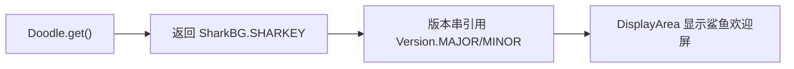

# 🧩 SharkBG

<Badge type="tip" text="GUI 涂鸦层" /> <Badge type="info" text="常量持有" />

> 鲨鱼 ASCII 艺术常量，版本串经 Version 动态派生，是 Doodle 默认活动涂鸦。

📁 源码：<code>ClassySharkWS/src/com/google/classyshark/gui/panel/displayarea/doodles/SharkBG.java</code> &nbsp; 📦 包：<code>com.google.classyshark.gui.panel.displayarea.doodles</code>

## 职责

`SharkBG` 是包私有类，持有公共静态常量 `SHARKEY`，内容为一只鲨鱼 ASCII 艺术。它链接 `retrojunkie.com`，版本串通过 `Version.MAJOR`/`Version.MINOR` 动态派生（`ClassyShark ver.X.Y powered by SilverGhost`）。它是 [[Doodle]] 门面默认返回的活动涂鸦。

## 关键方法 / 字段

| 名称 | 类型 | 说明 |
|------|------|------|
| `SHARKEY` | public static final String | 鲨鱼 ASCII 艺术 + 归因 + 动态版本串 |

## 工作流程

## 设计要点

- 🐋 **动态版本** — 唯一用 `Version.MAJOR`/`MINOR` 派生版本串的涂鸦，版本随构建变。
- 🐟 **默认活动涂鸦** — `Doodle.get()` 默认委托本类。
- 📝 **归属标注** — 链接 `retrojunkie.com` 来源。
- 🔒 **包私有类** — 仅 doodles 包内可见，经 [[Doodle]] 暴露。

## 协作关系

- 依赖 → `Version`（版本号）
- 被引用 ← [[Doodle]]（默认活动涂鸦）

## 已知问题 / TODO

- 无明显已知问题；纯常量类，版本动态派生是亮点。

## 相关文档

- [GUI 架构](/reference/architecture/gui-layer)
- [[Doodle]]
- [[Version]]
