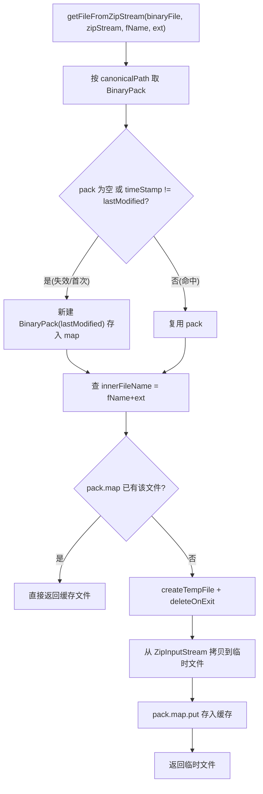

# 🧩 SherlockHash

<Badge type="tip" text="silverghost 核心" /> <Badge type="info" text="枚举单例 + 缓存" />

> 单例枚举缓存，从 ZipInputStream 提取指定条目到临时文件并按 (canonicalPath, lastModified) 缓存，避免重复解压。

📁 源码：<code>ClassySharkWS/src/com/google/classyshark/silverghost/io/SherlockHash.java</code> &nbsp; 📦 包：<code>com.google.classyshark.silverghost.io</code>

## 职责

`SherlockHash` 是 silverghost 子系统的 IO 层缓存组件，采用枚举单例（`INSTANCE`）。它把从 `ZipInputStream` 中提取出的条目写入临时文件，并按归档的 `canonicalPath` + `lastModified` 作为缓存键持久化，使同一条目在归档未变更时只解压一次。临时文件统一 `deleteOnExit`，进程退出时清理。它被 `MultidexReader` 和 `ElfTranslator` 使用，避免对 multidex 的次级 dex 或 ELF 二进制重复解压。「Sherlock」一名暗示其侦探式定位查找条目的行为。

## 关键方法 / 字段

| 名称 | 类型 | 说明 |
|------|------|------|
| `INSTANCE` | enum | 枚举单例实例，全局唯一缓存入口 |
| `mapPerBinary` | Map&lt;String, BinaryPack&gt; | 按归档 canonicalPath 索引到每个二进制文件的缓存包 |
| `BinaryPack.timeStamp` | long | 记录归档 lastModified，用作失效标记 |
| `BinaryPack.map` | Map&lt;String, File&gt; | 条目名(fName+ext) → 临时文件的映射 |
| `getFileFromZipStream(File, ZipInputStream, String, String)` | File | 从 zip 流提取条目到临时文件并缓存，命中即直接返回 |

## 工作流程

## 设计要点

- 🧩 **枚举单例** — `public enum SherlockHash { INSTANCE; }` 是 Java 推荐的线程安全单例写法，天然防反射与序列化攻击，全局共享一份缓存。
- 🔍 **双重缓存键** — 外层 `mapPerBinary` 按归档 `canonicalPath` 区分不同 APK，内层 `BinaryPack.map` 按条目名 `fName+ext` 区分条目，两级索引。
- 📊 **lastModified 作失效标记** — `BinaryPack.timeStamp` 记录构建时的归档 `lastModified`，若再次访问时 `lastModified` 变了即判失效重建，自动感知归档被替换/更新。
- 📦 **临时文件生命周期** — 用 `File.createTempFile` + `deleteOnExit`，进程退出时由 JVM 清理，不手动管理删除（代价是异常退出可能残留）。
- 🎨 **4KB 缓冲拷贝** — 内部用 `byte[1024*4]` 循环读写 ZipInputStream 到 FileOutputStream，是典型的流拷贝模式。
- 🔍 **被 multidex/ELF 复用** — `MultidexReader` 与 `ElfTranslator` 共用此缓存，避免对次级 dex 与 ELF 段的重复解压。

## 协作关系

- 被调用：MultidexReader（次级 dex 提取缓存）
- 被调用：ElfTranslator（ELF 二进制提取缓存）
- 协作：[[ContentReader]]（同属 IO 层，提供归档条目列表）

## 已知问题 / TODO

- ⚠️ 缓存键仅用 `canonicalPath + lastModified`，若归档被「原地修改但 lastModified 未变」（罕见但可能，如程序化改写后手动回拨时间戳），缓存会返回过期内容。
- ⚠️ `deleteOnExit` 仅在 JVM 正常退出时清理，强杀/崩溃会残留临时文件，长期运行可能堆积。
- ⚠️ `mapPerBinary` 无容量上限与淘汰策略，分析大量不同归档时内存会持续增长。
- `getFileFromZipStream` 的 `IOException` 直接抛出，依赖调用方处理。

## 相关文档

- [silverghost 核心架构](/reference/architecture/silverghost)
- [IO 层架构](/reference/architecture/io-layer)
- [API 指南](/api/index)
