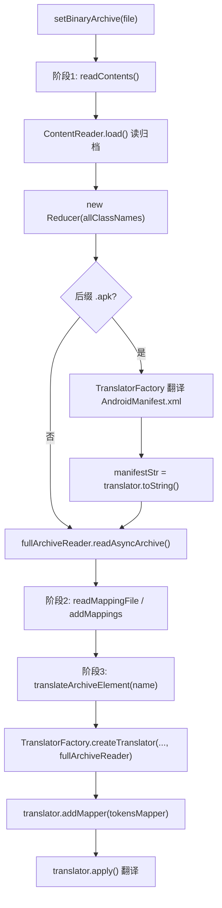

# 🧩 SilverGhost

<Badge type="tip" text="silverghost 核心" /> <Badge type="info" text="门面 + SPI" />

> 面向 GUI 的核心 API 类，编排归档读取、ProGuard 映射、命名元素翻译三阶段流水线。

📁 源码：<code>ClassySharkWS/src/com/google/classyshark/silverghost/SilverGhost.java</code> &nbsp; 📦 包：<code>com.google.classyshark.silverghost</code>

## 职责

`SilverGhost` 是 silverghost 子系统的核心 API 类，面向图形界面场景。它在类注释中明确警告「永远不要从 UI 线程调用 readXXX 方法」，因为其内部会执行解压、翻译等耗时操作。它编排三阶段流程：1) `ContentReader` 读取归档内容并实例化 `Reducer`；2) 读取 ProGuard 映射文件构建 `TokensMapper`；3) 通过 `TranslatorFactory` 翻译用户选中的命名元素。同时它会在 `readContents` 阶段预提取 APK 的 `AndroidManifest.xml` 文本，供后续 `getManifestMatches` 做快速子串搜索。

## 关键方法 / 字段

| 名称 | 类型 | 说明 |
|------|------|------|
| `tokensMapper` | static TokensMapper | 符号重映射 SPI 插槽，静态块默认为 `IdentityMapper` |
| `fullArchiveReader` | static FullArchiveReader | 全量归档读取 SPI 插槽，静态块默认为 `EmptyFullArchiveReader` |
| `readContents()` | void | 阶段 1：建 ContentReader、实例化 Reducer、提取 Manifest、触发 fullArchiveReader 异步读取 |
| `readMappingFile(File)` | TokensMapper | 阶段 2：让 tokensMapper 读取 ProGuard 映射并返回自身 |
| `addMappings(TokensMapper)` | void | 阶段 2 替代入口：直接注入一个已构建的映射器 |
| `translateArchiveElement(String)` | void | 阶段 3：用 TranslatorFactory 创建翻译器、注入 mapper、调用 apply |
| `getManifestMatches(String)` | List&lt;Translator.ELEMENT&gt; | 在预提取的 manifestStr 中子串搜索，带上下文 2 行，用 `::::` 分隔 |
| `isArchiveError()` | boolean | 检测「空归档」或「仅含 AndroidManifest.xml 的清单 APK」错误情形 |
| `filter(String)` | List&lt;String&gt; | 委托 Reducer 做类名前缀过滤 |
| `getComponents()` | List&lt;ContentReader.Component&gt; | 返回归档内组件列表（dex/jar/native 等） |

## 工作流程

## 设计要点

- 🔍 **三阶段编排显式编号** — 源码中以注释 `1. READ CONTENTS` / `2. READ MAPPINGS FILE` / `3. BINARY ARCHIVE ELEMENT` 标注阶段，流程清晰、阶段解耦。
- 🧩 **两个 SPI 插槽** — `tokensMapper`（默认 `IdentityMapper`）与 `fullArchiveReader`（默认 `EmptyFullArchiveReader`）均在静态块注入默认实现，是可替换的扩展点；`setBinaryArchive` 还会重置 `tokensMapper` 回 IdentityMapper 以防残留状态。
- 🎨 **Manifest 预提取 + 快速搜索** — `readContents` 提前把 AndroidManifest 翻成字符串缓存到 `manifestStr`，`getManifestMatches` 再做内存子串搜索，避免每次查询都重新解压翻译。
- 📊 **上下文 + 分隔符标记** — `getManifestMatches` 给命中行前后各补 2 行上下文，并以 `::::` 长分隔线作为 `Translator.TAG.SELECTION` 标记，配合 `Translator.ELEMENT` 体系供 GUI 高亮渲染。
- ⚠️ **线程约束写在注释** — 类 Javadoc 直接声明「never call readXXX method from UI thread」，依赖调用方自行保证后台线程执行。
- 🧩 **fullArchiveReader 回退链** — `translateArchiveElement` 把 `fullArchiveReader` 透传给 `TranslatorFactory`，使无匹配扩展名的元素可走全量归档读取回退路径。

## 协作关系

- 依赖：[[ContentReader]]
- 依赖：[[Reducer]]
- 依赖：[[TranslatorFactory]]
- 依赖：[[Translator]]
- 依赖：[[TokensMapper]]
- 依赖：[[FullArchiveReader]]
- 依赖：[[IdentityMapper]]
- 依赖：[[EmptyFullArchiveReader]]
- 被调用：[[Shark]]（间接经 SilverGhostFacade）

## 已知问题 / TODO

- ⚠️ `setBinaryArchive` 内注释 `TODO think of initialyzing data members as they hold prev file state`，成员字段可能残留上一个文件状态，目前仅手动重置 `tokensMapper`。
- ⚠️ `translateArchiveElement` 内注释 `TODO handle case when reducer is null or whatever`，缺少对 reducer 为空等异常场景的防御。
- `isArchiveError` 判定「仅含 AndroidManifest.xml」依赖类名集合恰好 size==1 且包含该字符串，边界较脆弱。

## 相关文档

- [silverghost 核心架构](/reference/architecture/silverghost)
- [快速开始](/guide/quick-start)
- [API 指南](/api/index)
