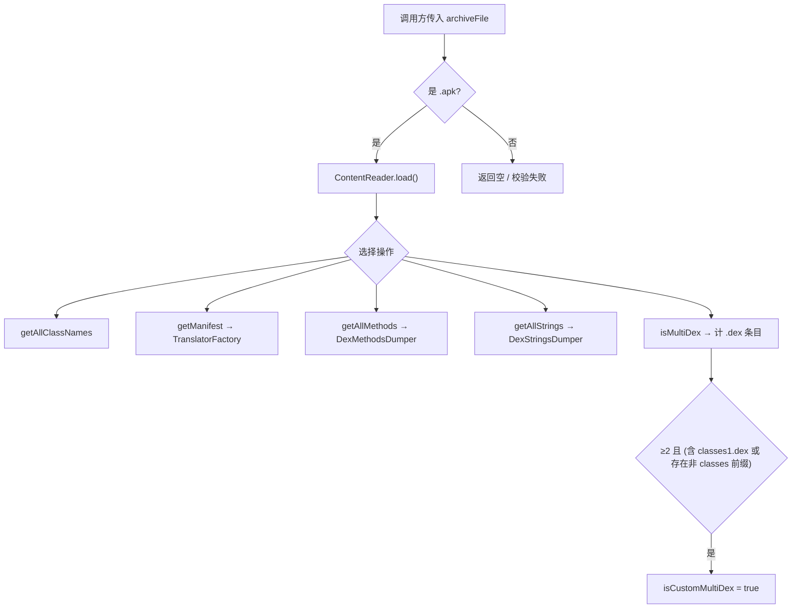

# 🧩 SilverGhostFacade

<Badge type="tip" text="silverghost 核心" /> <Badge type="info" text="静态工具门面" />

> 面向小而独立场景的基础 API，以全静态方法暴露 ClassyShark 的常用分析能力。

📁 源码：<code>ClassySharkWS/src/com/google/classyshark/silverghost/SilverGhostFacade.java</code> &nbsp; 📦 包：<code>com.google.classyshark.silverghost</code>

## 职责

`SilverGhostFacade` 是 silverghost 子系统的静态工具门面，类注释自称「基础 API 类，面向小而独立场景」。它把对归档的常用操作（列类名、导出类、查看 Manifest、列方法/字符串、统计包、判断 multidex 等）封装成无状态的静态方法，调用方无需自行组装 ContentReader、TranslatorFactory 等组件。CLI 工具与 [[Shark]] API 都直接复用这些静态方法。

## 关键方法 / 字段

| 名称 | 类型 | 说明 |
|------|------|------|
| `getAllClassNames(File)` | static List&lt;String&gt; | 用 ContentReader 载入归档并返回全部类名 |
| `exportClassFromApk(List&lt;String&gt;)` | static void | 从 APK 导出单个类文本，经 Exporter.writeCurrentClass 落盘 |
| `getGeneratedClassString(String, File)` | static String | 翻译指定类名并返回反编译文本，类不存在时返回空串 |
| `inspectApk(List&lt;String&gt;)` | static void | 校验 `.apk` 后缀后用 ApkTranslator 翻译并打印 |
| `getManifest(File)` | static String | 仅对 .apk 返回 AndroidManifest.xml 文本，否则空串 |
| `getAllMethods(File)` | static List&lt;String&gt; | 仅对 .apk 用 DexMethodsDumper.dumpMethods 列出方法 |
| `inspectPackages(List&lt;String&gt;)` | static void | RootBuilder 构建方法计数树，支持 `-flat` 切换 Flat/TreeMethodCountExporter |
| `getAllStrings(File)` | static List&lt;String&gt; | 仅对 .apk 用 DexStringsDumper.dumpStrings 列出字符串表 |
| `exportArchive(List&lt;String&gt;)` | static void | 用 Exporter.writeArchive 导出整个归档 |
| `isMultiDex(File)` | static boolean | 数 `.dex` 条目，≥2 即判定为 multidex（命中第 2 个即提前返回） |
| `isCustomMultiDex(File)` | static boolean | 在 isMultiDex 基础上判断含 classes1.dex 或存在非 `classes` 前缀 dex |

## 工作流程

## 设计要点

- 🧩 **纯静态 + 私有构造** — `private SilverGhostFacade()` 禁止实例化，全部能力以静态方法提供，是无状态工具门面。
- 🎨 **.apk 后缀守卫** — `getManifest`/`getAllMethods`/`getAllStrings` 在入口统一校验 `.apk` 后缀，非 APK 直接返回空列表或空串，避免对非 APK 文件误调 dex dumper。
- 📊 **multidex 提前剪枝** — `isMultiDex` 在数到第 2 个 dex 时即 `return true`，附带注释「2 dexes or more + optimization」，避免遍历全部条目。
- 🔍 **自定义 multidex 判定** — `isCustomMultiDex` 在标准 multidex 之上再判 `classes1.dex`（标准 multidex 命名）或非 `classes` 前缀的 dex（自定义 dex 加载方案），区分两种 multidex 形态。
- 🎨 **inspectPackages 双导出形态** — 通过扫描 `args` 中是否含 `-flat` 切换 `FlatMethodCountExporter` 与 `TreeMethodCountExporter`，同一份数据两种视图。
- ⚠️ **异常吞并** — `exportClassFromApk`/`getGeneratedClassString` 捕获 `NullPointerException` 视为「类不存在」，吞掉而非抛出，对调用方友好但可能掩盖真实 NPE。

## 协作关系

- 依赖：[[ContentReader]]
- 依赖：[[TranslatorFactory]]
- 依赖：[[Translator]]
- 依赖：[[ApkTranslator]]
- 依赖：[[DexMethodsDumper]]
- 依赖：[[DexStringsDumper]]
- 依赖：[[RootBuilder]]
- 依赖：[[Exporter]]
- 被调用：[[Shark]]

## 已知问题 / TODO

- ⚠️ `exportClassFromApk` 的错误信息拼写为「Class doesn't exist in the writeArchive」（疑似应为 archive），`getGeneratedClassString` 中亦有同类拼写。
- ⚠️ `isCustomMultiDex` 会重复调用一次 `isMultiDex`，内部又新建一次 ContentReader 加载，存在重复解压开销。
- `inspectPackages` 仅把错误信息打印到 `System.err`，未抛出异常，CI 场景下退出码可能无法反映失败。

## 相关文档

- [silverghost 核心架构](/reference/architecture/silverghost)
- [API 指南](/api/index)
- [CLI 参考](/cli/index)
