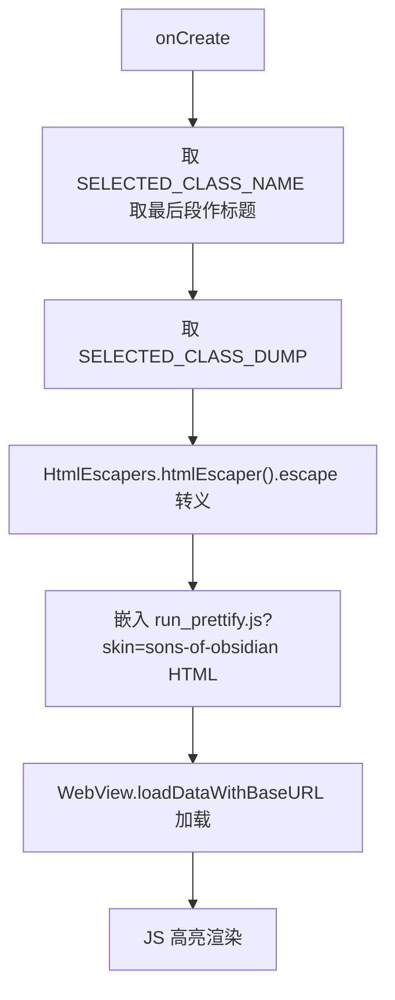

# 🧩 SourceViewerActivity

<Badge type="tip" text="Android 子系统" /> <Badge type="info" text="展示 Activity" />

> 用 WebView + Google code-prettify（sons-of-obsidian 皮肤）高亮显示类 dump 文本，用 Guava HtmlEscapers 转义内容。

📁 源码：<code>ClassySharkAndroid/app/src/main/java/com/google/classysharkandroid/activities/SourceViewerActivity.java</code> &nbsp; 📦 包：<code>com.google.classysharkandroid.activities</code>

## 职责

`SourceViewerActivity` 负责展示单个类的"源码"dump 文本并语法高亮。`onCreate` 从 Intent 取类名（取最后一段作 ActionBar 标题，黄色高亮）与 dump 文本，经 Guava `HtmlEscapers.htmlEscaper().escape` 转义后，嵌入一段含 `run_prettify.js?skin=sons-of-obsidian` 的 HTML，用 `WebView.loadDataWithBaseURL` 加载。它复用 Google code-prettify JS 库做语法高亮而非自己实现，黑色背景配合 sons-of-obsidian 主题。

## 关键方法 / 字段

| 名称 | 类型 | 说明 |
|------|------|------|
| `sourceCodeText` | private String | 待展示的源码文本 |
| `onCreate(Bundle)` | protected void | 取 dump + 转义 + WebView 加载 |
| `webView` | 局部 WebView | 展示高亮源码 |

## 工作流程

## 设计要点

- 🎨 **复用 code-prettify** — 用 Google 的 `run_prettify.js` 做 JS 语法高亮，不自研高亮引擎。
- 🌑 **sons-of-obsidian 皮肤** — 黑色背景配合深色高亮主题，与 ClassyShark 深色风格一致。
- 🛡️ **HTML 转义** — Guava `HtmlEscapers` 转义 dump 内容，防 XSS 与 HTML 解析错误。
- 📜 **baseURL 指向 asset** — `file:///android_asset/` 让 `run_prettify.js` 从 assets 加载。
- 🖤 **黑色背景** — `getWindow().getDecorView().setBackgroundColor(Color.BLACK)`。

## 协作关系

- 依赖：[[ClassesListActivity]]（extra 键来源）、Guava `HtmlEscapers`
- 被调用：[[ClassesListActivity]]（点击类名后启动）

## 已知问题 / TODO

- `onPageFinished` 为空实现（WebViewClient 未做任何事，可省略）。
- 异常仅 `printStackTrace`，dump 取不到时显示空内容。
- `loadDataWithBaseURL` 的 HTML 字符串硬编码且超长，可维护性差。

## 相关文档

- [Android 子系统架构](/reference/architecture/android)
