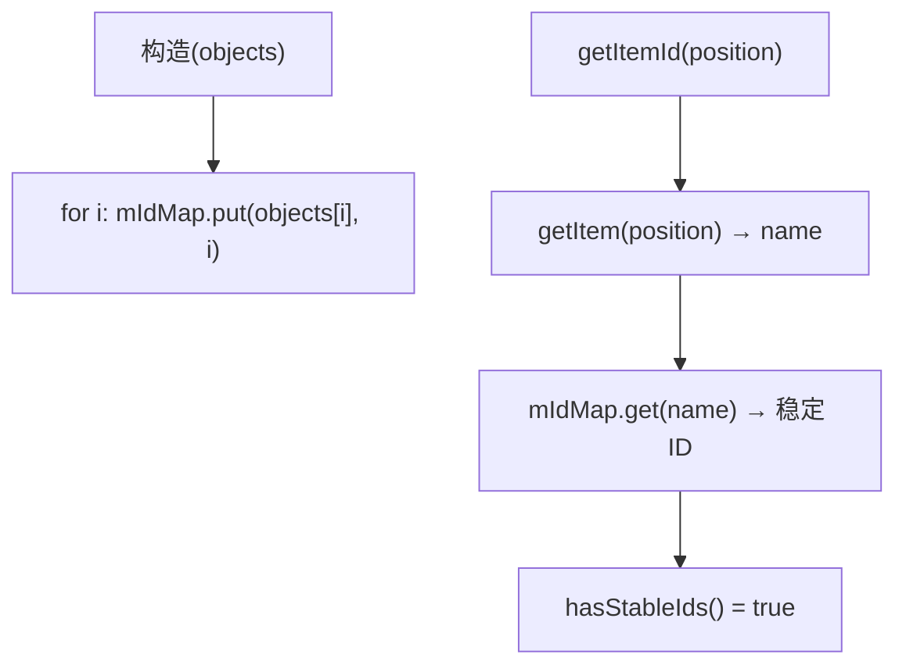

# 🧩 StableArrayAdapter

<Badge type="tip" text="Android 子系统" /> <Badge type="info" text="列表适配器" />

> `ArrayAdapter<String>` 子类：用 HashMap 维护 name→position 映射，`hasStableIds()` 返 true，解决列表 ID 不稳定问题。

📁 源码：<code>ClassySharkAndroid/app/src/main/java/com/google/classysharkandroid/adapters/StableArrayAdapter.java</code> &nbsp; 📦 包：<code>com.google.classysharkandroid.adapters</code>

## 职责

`StableArrayAdapter` 继承 `ArrayAdapter<String>`，在构造时遍历传入的字符串列表，把每个 name 映射到其位置索引存入 `HashMap<String, Integer> mIdMap`。重写 `getItemId(position)` 返回该 item 对应的稳定 ID（来自 map），`hasStableIds()` 返回 `true`。这是 Android 经典模式——当列表数据变化或视图回收重建时，保证同一数据项的 row ID 稳定，避免选中/动画错乱。

## 关键方法 / 字段

| 名称 | 类型 | 说明 |
|------|------|------|
| `mIdMap` | HashMap&lt;String, Integer&gt; | name→position 映射 |
| `StableArrayAdapter(Context, int, List)` | 构造器 | 构造时填充 mIdMap |
| `getItemId(int)` | long | 返回 mIdMap.get(getItem(position)) |
| `hasStableIds()` | boolean | 返回 true |

## 工作流程

## 设计要点

- 🆔 **稳定 ID** — `hasStableIds()` 返 true + name→position 映射，保证列表项 ID 跨数据变化稳定。
- 🗺️ **HashMap 查表** — `getItemId` 经 map 查 position 作 ID，O(1)。
- 🧩 **经典 Android 模式** — 解决 `ListView` 数据变化时 ID 不稳定导致的选择/动画错乱。
- 🪶 **极简实现** — 仅重写两方法 + 一个 map 字段。

## 协作关系

- 依赖：无
- 被调用：[[MainActivity]]、[[ClassesListActivity]]（填充 ListView）

## 已知问题 / TODO

- 当列表含重复字符串名时，`mIdMap` 后者覆盖前者，`getItemId` 返回的 ID 不唯一（稳定性假设失效）。
- 数据动态增删时未同步更新 `mIdMap`，仅适合静态列表。

## 相关文档

- [Android 子系统架构](/reference/architecture/android)
