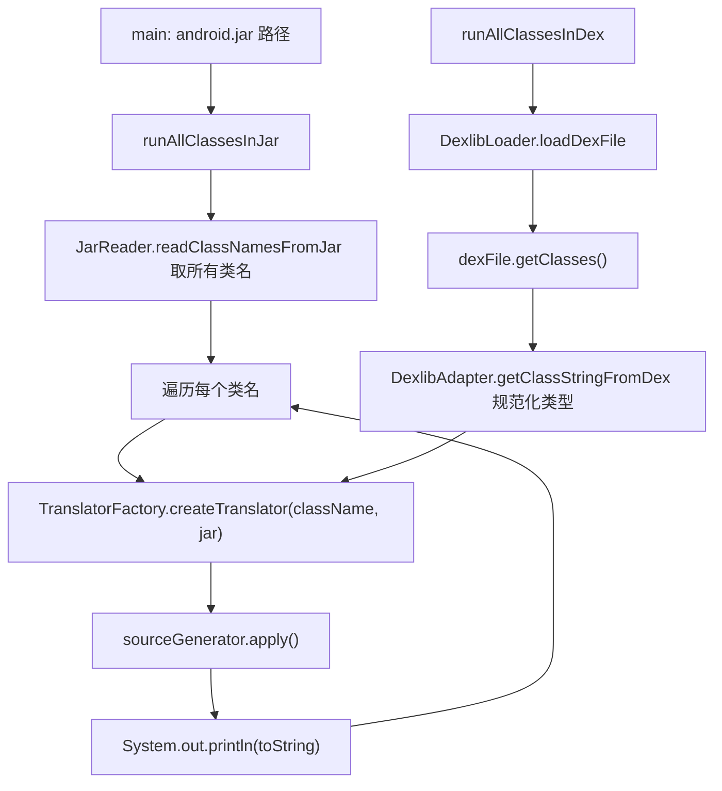

# 🧩 StressTest

<Badge type="tip" text="Java Translator" /> <Badge type="info" text="测试工具 / 健全性压测" />

> 遍历 jar/dex 全部类经 TranslatorFactory 翻译并打印的健全性测试工具。

📁 源码：<code>ClassySharkWS/src/com/google/classyshark/silverghost/translator/java/StressTest.java</code> &nbsp; 📦 包：<code>com.google.classyshark.silverghost.translator.java</code>

## 职责

`StressTest` 是 Java Translator 子系统的健全性测试工具。它遍历一个 jar 或 dex 中的所有类，逐一经 `TranslatorFactory.createTranslator` 创建翻译器并 `apply()`，再把渲染结果打印到 stdout，以此验证整条翻译管道在大规模类集上不崩溃。它证明了管道可扩展到约 5 万个类（如 `android.jar`）。它本身不是 `Translator`，只是测试驱动。

## 关键方法 / 字段

| 名称 | 类型 | 说明 |
|------|------|------|
| `runAllClassesInJar(String jarCanonicalPath)` | static void | `JarReader.readClassNamesFromJar` 读名，逐类翻译打印 |
| `runAllClassesInDex(String jarCanonicalPath)` | static void | `DexlibLoader.loadDexFile` + `getClasses`，逐类翻译打印 |
| `main(String[])` | static void | 入口：在 `android.jar` 上跑 `runAllClassesInJar` |

## 工作流程

## 设计要点

- **双源对称** — `runAllClassesInJar` 与 `runAllClassesInDex` 结构对称：取类名列表 → 遍历 → 建翻译器 → apply → 打印，差异仅在类名来源（`JarReader` vs `DexlibLoader`+`ClassDef`）。
- **dex 类型规范化** — `runAllClassesInDex` 用 `DexlibAdapter.getClassStringFromDex(currentClass.getType())` 把 dexlib 类型串规范成 Java 全限定名，再交工厂，保证工厂能正确路由。
- **管道健全性验证** — 不校验输出内容正确性，只验证「不抛异常地跑完全部类」，是冒烟/压测性质，证明管道对 ~50000 类（android.jar）规模可用。
- **非 Translator** — 本类不实现 `Translator` 接口，仅作测试入口，位于 translator 包内以便访问内部组件。

## 协作关系

- 调用 → [[TranslatorFactory]]（创建翻译器）
- 调用 → `JarReader`（jar 类名）、`DexlibLoader`（dex 加载）
- 依赖 → [[DexlibAdapter]]（dex 类型规范化）
- 间接驱动 [[JavaTranslator]] 及全部 MetaObject 子类

## 已知问题 / TODO

- 无断言、无结果比对，仅靠「不崩溃」判定通过，无法捕捉语义回归。
- `main` 硬编码桌面 `android.jar` 路径，未参数化。
- 输出全量打印到 stdout，对 5 万类规模产生巨量 IO，不适合常规 CI。

## 相关文档

- [Java Translator 子系统](/reference/architecture/java-translator)
- [Java 翻译器](/reference/modules/JavaTranslator)
- [翻译器工厂](/reference/modules/TranslatorFactory)
