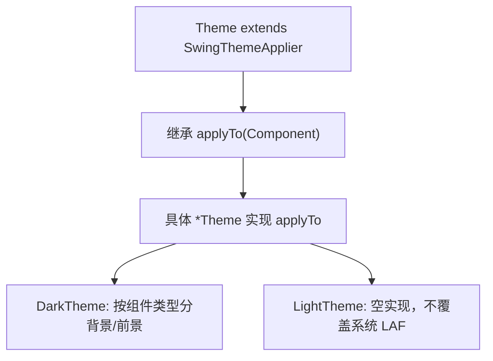

# 🧩 SwingThemeApplier

<Badge type="tip" text="主题子系统" /> <Badge type="info" text="函数式接口" />

> 通用函数式接口：把"应用到 Swing 组件"这一方面从主题颜色/图标获取器中分离出来。

📁 源码：<code>ClassySharkWS/src/com/google/classyshark/gui/theme/SwingThemeApplier.java</code> &nbsp; 📦 包：<code>com.google.classyshark.gui.theme</code>

## 职责

`SwingThemeApplier<T>` 是一个极简的泛型函数式接口，只声明一个方法 `void applyTo(T component)`。它将"把某个主题应用到 Swing 组件上"这一职责抽象成独立的类型，使 `Theme` 接口通过 `extends SwingThemeApplier<Component>` 继承该能力。这样颜色/图标获取器方面与应用到组件方面解耦——即便 `Theme` 把泛型实参固定为 `Component`，仍允许其他类型化变体（如针对特定组件子集的 applier）存在。

## 关键方法 / 字段

| 名称 | 类型 | 说明 |
|------|------|------|
| `applyTo(T component)` | void | 将主题应用到给定组件（抽象） |

## 工作流程

## 设计要点

- 🧩 **方面分离** — "应用到组件"与"提供颜色/图标"是两个正交方面，本接口只管前者。
- 🔧 **泛型 `<T>`** — 虽 `Theme` 固定 `T=Component`，接口本身允许针对更窄组件类型的变体。
- 🪶 **单方法函数式** — 可作 lambda/方法引用目标，尽管当前仅被 `Theme` 继承。
- 📦 **包级可见** — 接口本身为包私有（无 `public`），仅在主题包内被 `Theme` 继承。

## 协作关系

- 实现：[[Theme]]（`extends SwingThemeApplier<Component>`）
- 间接实现：[[DarkTheme]]、[[LightTheme]]

## 已知问题 / TODO

- 无明显已知问题（极简契约接口，职责单一）。

## 相关文档

- [主题子系统架构](/reference/architecture/theme)
