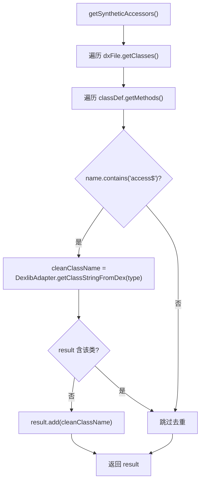

# 🧩 SyntheticAccessorsInspector

<Badge type="tip" text="APK Dashboard" /> <Badge type="info" text="检查器" />

> 扫描 DexFile 找出含 `access$` 合成访问器的类，检测代码异味。

📁 源码：<code>ClassySharkWS/src/com/google/classyshark/silverghost/translator/apk/dashboard/SyntheticAccessorsInspector.java</code> &nbsp; 📦 包：<code>com.google.classyshark.silverghost.translator.apk.dashboard</code>

## 职责

`SyntheticAccessorsInspector` 遍历 `DexFile` 的所有类与方法，找出方法名含 `access$` 的类——这些是编译器为内部类访问外部类私有成员而合成的访问器方法，属代码异味。`getSyntheticAccessors()` 把命中的类名（经 `DexlibAdapter` 清洗后）去重收集进列表返回。检查器本身完整可用，但当前在 `ApkDashboard.fillAnalysisPerClassesDexIndex` 中的接线被注释掉，故未实际产出数据。

## 关键方法 / 字段

| 名称 | 类型 | 说明 |
|------|------|------|
| `dxFile` | DexFile | 待扫描的 dex 文件 |
| `SyntheticAccessorsInspector(DexFile)` | 构造器 | 保存 dex 文件 |
| `getSyntheticAccessors()` | List&lt;String&gt; | 返回含 access$ 的类名列表 |

## 工作流程

## 设计要点

- 🔍 **异味检测** — `access$` 是 `javac`/`dx` 为内部类访问外部私有成员生成的合成方法名前缀，出现即提示可访问性设计问题。
- 🧹 **去重收集** — 用 `!result.contains(...)` 手动去重，同一类多个 access$ 方法只记一次类名。
- 🛠️ **依赖 DexlibAdapter** — 类名经 `DexlibAdapter.getClassStringFromDex` 清洗，把 dex 型 `Lfoo/bar/Baz;` 转为可读形式。
- ⚠️ **存在但未接线** — 检查器代码完整，但 `ApkDashboard` 中调用它的两行被注释，结果无法进入 `ClassesDexDataEntry.syntheticAccessors`。

## 协作关系

- 设计上被 [[ApkDashboard]] 的 `fillAnalysisPerClassesDexIndex` 调用（**当前被注释，未接线**）
- 依赖 [[DexlibAdapter]] 做类名清洗

## 已知问题 / TODO

- 检查器未接线：`ApkDashboard.fillAnalysisPerClassesDexIndex` 中 `//dexData.syntheticAccessors = new SyntheticAccessorsInspector(dxFile).getSyntheticAccessors();` 被注释，`ClassesDexDataEntry.syntheticAccessors` 永远为 null。
- 去重用 `List.contains` 线性查找，大 dex 上性能不佳，应改用 `LinkedHashSet`。

## 相关文档

- [APK Dashboard 架构](/reference/architecture/apk-dashboard)
- [代码异味检查](/reference/architecture/apk-dashboard)
