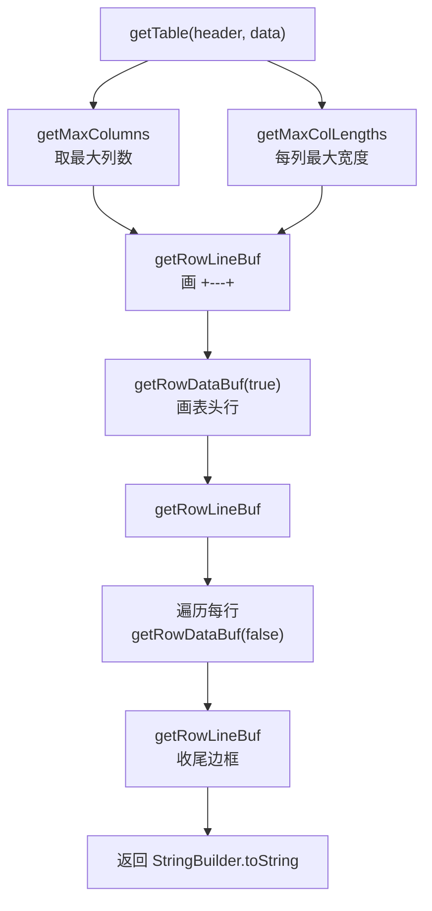

# 🧩 Table

<Badge type="tip" text="APK Dashboard" /> <Badge type="info" text="格式化工具" />

> 通用 ASCII 表格格式化器，按最大列宽对齐并画 +---+---+ 边框，支持左中右对齐。

📁 源码：<code>ClassySharkWS/src/com/google/classyshark/silverghost/translator/apk/dashboard/Table.java</code> &nbsp; 📦 包：<code>com.google.classyshark.silverghost.translator.apk.dashboard</code>

## 职责

`Table` 是一组静态方法，把表头字符串数组 + 数据二维数组渲染成带边框的 ASCII 表格。它计算每列最大宽度，按对齐方式补空格，画 `+---+---+` 边框与 `| cell | cell |` 行。还提供类型化重载，接收对象集合 + `Column.Data<T>` 列定义（含 getter 函数）。第三方来源（ned.twigg@diffplug.com 与 K Venkata Sudhakar），自包含 `StringBuilder`，无 Swing 依赖。`ApkDashboard.toString` 即调 `Table.getTable`。

## 关键方法 / 字段

| 名称 | 类型 | 说明 |
|------|------|------|
| `getTable(Collection&lt;T&gt;, List&lt;Column.Data&lt;T&gt;&gt;)` | static &lt;T&gt; String | 类型化重载，用列 getter 提取数据 |
| `getTable(String[], String[][])` | static String | 表头字符串 + 数据数组重载 |
| `getTable(Column[], String[][])` | static String | 核心渲染，画边框与行 |
| `getRowLineBuf(...)` | private static String | 画 `+---+---+` 边框行 |
| `getRowDataBuf(...)` | private static String | 画 `| cell |` 数据/表头行 |
| `getFormattedData(int, String, Align)` | private static String | 按对齐补空格到列宽 |
| `getMaxColLengths(...)` | private static List&lt;Integer&gt; | 每列最大内容长度 |
| `Column`（嵌套类） | static class | 列标题 + 表头/数据对齐 |
| `Column.Align`（嵌套枚举） | enum | LEFT/CENTER/RIGHT + 默认值 |
| `Column.Data&lt;T&gt;`（嵌套类） | static class | 列 + getter 函数的数据驱动列 |

## 工作流程

## 设计要点

- 📊 **双 API 风格** — 既支持原始 `String[][]`，也支持类型化 `Collection<T> + Column.Data<T>`（带 getter 函数），适配命令式与声明式两种用法。
- 🎨 **三向对齐** — `Column.Align` 支持 LEFT/CENTER/RIGHT，CENTER 用 `toggle` 交替左右补空格，表头与数据可分别设默认对齐。
- 🧮 **最大列宽对齐** — `getMaxColLengths` 综合表头与所有数据求每列最大长度，`getFormattedData` 按此补空格保证等宽。
- 🧱 **自包含无依赖** — 全程 `StringBuilder`，无 Swing/AWT，纯文本输出，适合 CLI 与日志。
- 📦 **嵌套 DSL** — `Column`/`Column.Data`/`Column.Align` 构成内部领域特定语言，链式 `column.with(getter)` 构造数据列。

## 协作关系

- 被 [[ApkDashboard]] 的 `toString()` 调用（`Table.getTable(columnHeaders, array)`）

## 已知问题 / TODO

- 仍使用匿名内部类 + `Function` 桥接旧式写法（`getTable(Collection, List)` 中），未用现代流式 API 精简；属历史代码风格。
- `getMaxColumns` 假设 `header` 非空，空表头场景需调用方保证。

## 相关文档

- [APK Dashboard 架构](/reference/architecture/apk-dashboard)
- [表格渲染](/reference/architecture/apk-dashboard)
