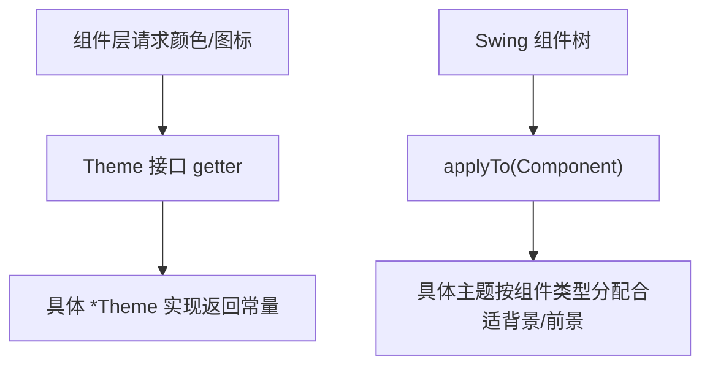

# 🧩 Theme

<Badge type="tip" text="主题子系统" /> <Badge type="info" text="契约接口" />

> 定义主题契约的接口：8 个工具栏图标获取器与 7 个语义颜色获取器，具体主题类须全部履行。

📁 源码：<code>ClassySharkWS/src/com/google/classyshark/gui/theme/Theme.java</code> &nbsp; 📦 包：<code>com.google.classyshark.gui.theme</code>

## 职责

`Theme` 是整个主题子系统的契约接口，定义了一套主题必须对外暴露的"参数"——工具栏用到的 8 个 `ImageIcon`（切换/最近/后退/前进/打开/导出/映射/设置）以及代码高亮/界面着色用到的 7 个 `Color`（默认/关键字/标识符/注解/选中背景/名称/背景）。它继承自 `SwingThemeApplier<Component>`，因此每个具体主题还必须实现 `applyTo(Component)` 以在组件级定制 Swing 外观。任何新增 `*Theme` 实现类都必须完整实现这套方法。

## 关键方法 / 字段

| 名称 | 类型 | 说明 |
|------|------|------|
| `getToggleIcon()` | ImageIcon | 主题切换图标 |
| `getRecentIcon()` | ImageIcon | 最近文件图标 |
| `getBackIcon()` | ImageIcon | 后退图标 |
| `getForwardIcon()` | ImageIcon | 前进图标 |
| `getOpenIcon()` | ImageIcon | 打开图标 |
| `getExportIcon()` | ImageIcon | 导出图标 |
| `getMappingIcon()` | ImageIcon | 映射图标 |
| `getSettingsIcon()` | ImageIcon | 设置图标 |
| `getDefaultColor()` | Color | 默认文本颜色 |
| `getKeyWordsColor()` | Color | 关键字颜色 |
| `getIdentifiersColor()` | Color | 标识符颜色 |
| `getAnnotationsColor()` | Color | 注解颜色 |
| `getSelectionBgColor()` | Color | 选中文本背景色 |
| `getNamesColor()` | Color | 名称颜色 |
| `getBackgroundColor()` | Color | 通用背景色 |

## 工作流程

## 设计要点

- 🎨 **颜色获取器映射语义角色** — `DisplayArea.fillTokensToDoc` 按词法角色调用对应 getter 着色；新增语法角色时须同时加 getter 与两套实现（深/浅）。
- 🧩 **继承 `SwingThemeApplier<Component>`** — 将"应用到 Swing 组件"这一方面与"颜色/图标获取器"方面分离，`Theme` 通过泛型绑定到 `Component`。
- 📐 **契约完备性** — 接口只定义行为，不持状态；图标在具体类构造时加载、颜色由具体类返回 `*ColorScheme` 常量。
- 🔒 **15 个 getter 全部无参** — 主题一旦构造即不可变，调用方零成本读取。

## 协作关系

- 依赖：[[SwingThemeApplier]]（继承其 `applyTo`）
- 实现：[[DarkTheme]]、[[LightTheme]]
- 被调用：[[ThemeManager]]（按类名反射实例化）、`DisplayArea`（颜色获取器）

## 已知问题 / TODO

- 源码注释提到颜色角色命名可能需调整（`DarkTheme` 中 `// TODO was default need to change names`）。

## 相关文档

- [主题子系统架构](/reference/architecture/theme)
- [主题切换指南](/gui/themes)
