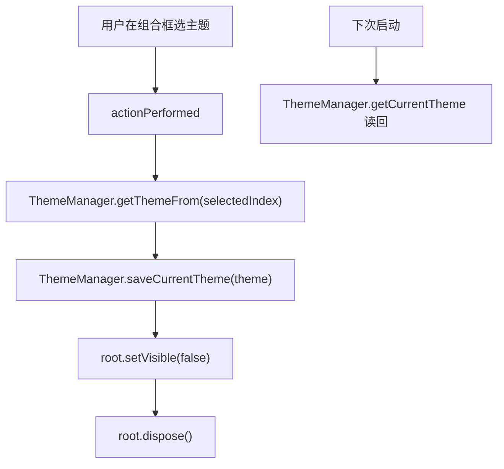

# 🧩 ThemeChosenListener

<Badge type="tip" text="GUI 设置层" /> <Badge type="info" text="监听器" />

> 组合框 ActionListener，保存选定主题后关闭设置窗口。

📁 源码：<code>ClassySharkWS/src/com/google/classyshark/gui/settings/ThemeChosenListener.java</code> &nbsp; 📦 包：<code>com.google.classyshark.gui.settings</code>

## 职责

`ThemeChosenListener` 实现 `ActionListener`，监听设置窗口的主题组合框。用户选择某主题时，它经 `ThemeManager.getThemeFrom(index)` 取主题对象，调 `ThemeManager.saveCurrentTheme(theme)` 持久化，然后关闭（隐藏并 dispose）设置窗口。它是主题选择持久化的唯一入口——GUI 其余部分启动时经 `ThemeManager.getCurrentTheme()` 读回。

## 关键方法 / 字段

| 名称 | 类型 | 说明 |
|------|------|------|
| `root` | JFrame | 构造时捕获的设置窗口 |
| `comboBox` | JComboBox | 主题组合框 |
| `ThemeChosenListener(JFrame, JComboBox)` | 构造 | 捕获根框与组合框 |
| `actionPerformed(ActionEvent)` | void | 取选中主题→保存→关窗 |

## 工作流程

## 设计要点

- 💾 **持久化处** — 主题选择经此监听器落盘，是「下次启动生效」的关键写入点。
- 🪶 **轻量无状态** — 除根框引用外无状态，逻辑极简。
- 🚪 **关窗托管** — 选完即隐藏并 dispose 设置窗口，避免遗留。

## 协作关系

- 依赖 → `ThemeManager`
- 被附加 ← [[SettingsFrame]]

## 已知问题 / TODO

- 🐛 保存主题后不通知主窗口刷新，主题切换须重启才生效（与 SettingsFrame 设计一致）。
- 🐛 `JComboBox` 用原始类型无泛型，`getSelectedIndex` 无类型安全风险但风格陈旧。

## 相关文档

- [GUI 架构](/reference/architecture/gui-layer)
- [[SettingsFrame]]
