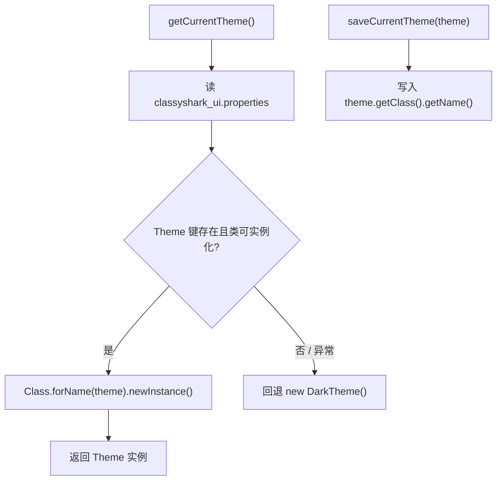

# 🧩 ThemeManager

<Badge type="tip" text="主题子系统" /> <Badge type="info" text="静态注册表" />

> 静态注册表：以类名持久化选定主题到 properties 文件，重启后反射还原，并在显示数组与主题实例间转换。

📁 源码：<code>ClassySharkWS/src/com/google/classyshark/gui/theme/ThemeManager.java</code> &nbsp; 📦 包：<code>com.google.classyshark.gui.theme</code>

## 职责

`ThemeManager` 是主题子系统的静态注册表与持久化层。它把用户当前选定的主题以"类名"形式写入工作目录下的 `classyshark_ui.properties`（键 `Theme`），下次启动时通过 `Class.forName(...).newInstance()` 反射重建对应主题实例。它还维护一个硬编码的显示数组 `{"Light","Dark"}`，负责在 UI 下拉框的显示索引与 `Theme` 实例之间互转。所有方法均为静态，无需实例化。

## 关键方法 / 字段

| 名称 | 类型 | 说明 |
|------|------|------|
| `PROP_FILE` | static final String | 属性文件名 `classyshark_ui.properties` |
| `THEME_KEY` | static final String | 属性键 `Theme` |
| `themes` | static final String[] | 硬编码显示数组 `{"Light","Dark"}` |
| `LIGHT` / `DARK` | static final int | 显示索引常量 0 / 1 |
| `saveCurrentTheme(Theme)` | static void | 以类名持久化当前主题到 properties |
| `getCurrentTheme()` | static Theme | 读属性反射实例化；失败回退 `DarkTheme` |
| `getThemes()` | static String[] | 返回显示名数组 |
| `getThemeIndexFrom(Theme)` | static int | 主题实例→显示索引 |
| `getThemeFrom(int)` | static Theme | 显示索引→主题实例 |

## 工作流程

## 设计要点

- 💾 **按类名持久化** — 加新主题只需实现 `Theme` 的类，无需修改 `ThemeManager`，用户选择可跨重启存活；但要求该类有无参构造。
- 🌑 **默认回退 `DarkTheme` 非 `LightTheme`** — 全新安装（无 properties 文件）落到深色，意味着开箱即深色。
- 🧱 **显示数组硬编码** — `{"Light","Dark"}` 与实际主题类解耦，索引转换在 `getThemeIndexFrom`/`getThemeFrom` 中用 `instanceof` 判定。
- 🤐 **异常静默吞** — `saveCurrentTheme` 的 `IOException` 被 catch 空块吞掉，保存失败不通知用户。

## 协作关系

- 依赖：[[Theme]]（管理的类型）、[[DarkTheme]]（默认回退）、[[LightTheme]]（索引 0 实例）
- 被调用：主题切换 UI（保存/读取用户选择）

## 已知问题 / TODO

- 显示数组与主题类列表硬编码且不联动——新增主题须手动改 `themes` 数组与 `getThemeIndexFrom`/`getThemeFrom` 的判定。
- `getCurrentTheme` 使用已废弃的 `Class.newInstance()`，且 `Class<Theme>` 的强制转换未经校验（属性里写错类名会在反射时抛异常被吞，回退深色）。
- 保存失败静默，用户无法感知主题未持久化。

## 相关文档

- [主题子系统架构](/reference/architecture/theme)
- [主题切换指南](/gui/themes)
