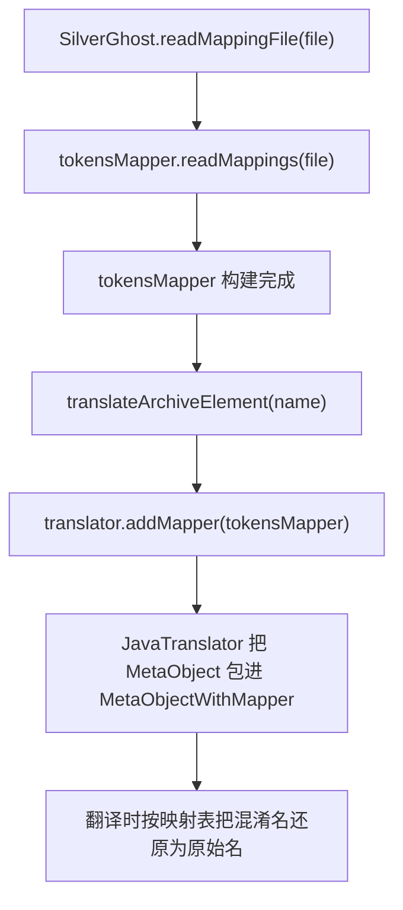

# 🧩 TokensMapper

<Badge type="tip" text="silverghost 核心" /> <Badge type="info" text="SPI + 装饰器" />

> 符号重映射 SPI 接口（ProGuard 逆向映射），把混淆名还原成原始类名。

📁 源码：<code>ClassySharkWS/src/com/google/classyshark/silverghost/TokensMapper.java</code> &nbsp; 📦 包：<code>com.google.classyshark.silverghost</code>

## 职责

`TokensMapper` 是 silverghost 子系统的符号重映射 SPI 接口，用于 ProGuard 混淆的逆向映射。它声明两个方法：从映射文件构建映射器自身、以及返回「混淆名 → 原始类名」的映射表。[[SilverGhost]] 在静态块默认注入 `IdentityMapper`（恒等映射，即不还原），并通过 `readMappingFile`/`addMappings` 流程让映射器在翻译阶段生效——具体由 JavaTranslator 把普通 `MetaObject` 包进 `MetaObjectWithMapper` 装饰器，使翻译输出时把混淆符号替换为原始名。

## 关键方法 / 字段

| 名称 | 类型 | 说明 |
|------|------|------|
| `readMappings(File file)` | TokensMapper | 从 ProGuard mapping 文件构建映射并返回自身（链式） |
| `getReverseClasses()` | Map&lt;String,String&gt; | 返回 混淆名 → 原始类名 的映射表 |

## 工作流程

## 设计要点

- 🧩 **SPI + 装饰器组合** — 接口本身是 SPI 扩展点，默认实现 `IdentityMapper` 为恒等映射；运行时通过 `MetaObjectWithMapper` 装饰器包装 MetaObject，把映射逻辑织入翻译流程，而非侵入翻译器内部。
- 🔍 **readMappings 链式返回自身** — 返回 `TokensMapper` 而非 void，允许 `SilverGhost.readMappingFile` 直接把构建好的映射器回传给调用方。
- 📦 **默认 IdentityMapper 解耦** — [[SilverGhost]] 静态块默认 IdentityMapper，使无映射文件场景下翻译照常进行（输出即混淆名），第三方可替换为真实映射实现。
- 🎨 **reverse 语义** — `getReverseClasses` 名字中的「reverse」强调是 ProGuard 正向映射的逆向（混淆→原始），与 ProGuard mapping 文件原始方向（原始→混淆）相反。

## 协作关系

- 依赖：[[Translator]]（addMapper 接收 TokensMapper）
- 实现方：[[IdentityMapper]]（默认恒等实现）
- 被调用：[[SilverGhost]]（readMappingFile/addMappings/translateArchiveElement）
- 协作：JavaTranslator + MetaObjectWithMapper（装饰器织入映射）

## 已知问题 / TODO

- 无明显已知问题。接口职责单一，映射构建与查询分离清晰。

## 相关文档

- [silverghost 核心架构](/reference/architecture/silverghost)
- [ProGuard 映射](/guide/concepts/proguard-mapping)
- [API 指南](/api/index)
