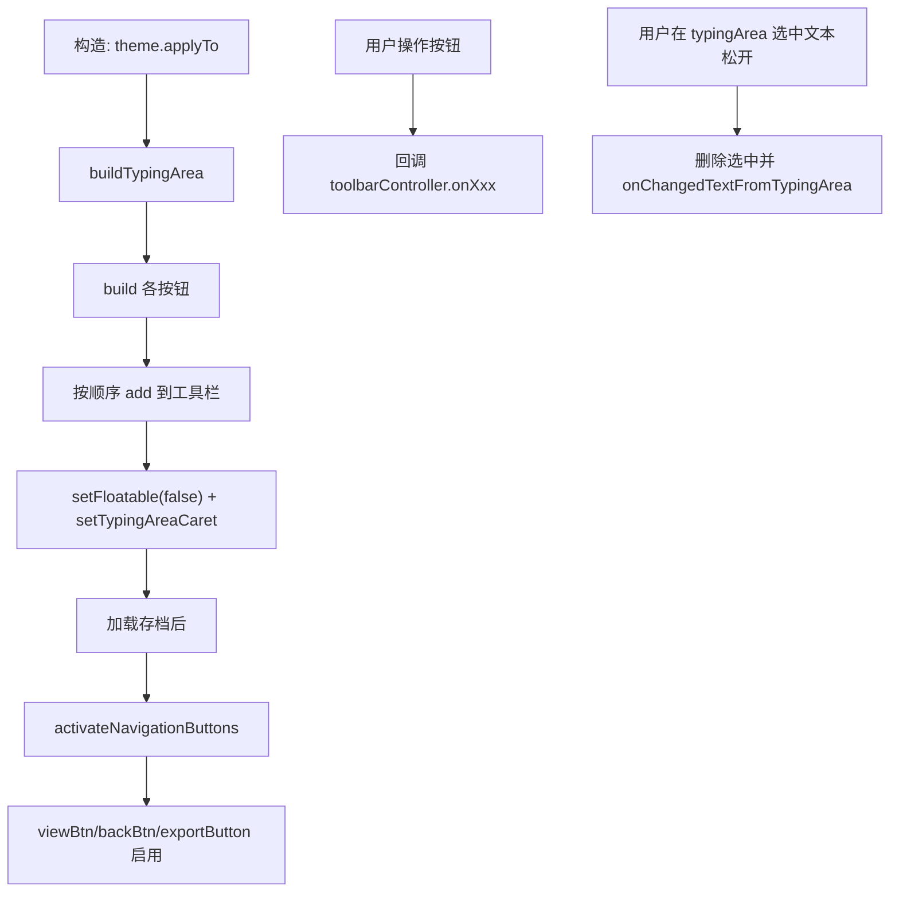

# 🧩 Toolbar

<Badge type="tip" text="GUI 工具栏层" /> <Badge type="info" text="构建器" />

> 建顶部 JToolBar：按钮组 + 50 字输入框 typingArea，所有图标取自主题。

📁 源码：<code>ClassySharkWS/src/com/google/classyshark/gui/panel/toolbar/Toolbar.java</code> &nbsp; 📦 包：<code>com.google.classyshark.gui.panel.toolbar</code>

## 职责

`Toolbar` 继承 `JToolBar`，构建顶部工具栏：左面板切换、打开、后退、查看（下个）、映射、导出、最近、设置按钮，加一个 50 字的 `typingArea` 输入框。每个按钮的操作回调 `ToolbarController`。后退/查看/导出初始禁用，仅在 `activateNavigationButtons`（存档加载后）启用。所有图标来自 `theme.getXxxIcon`，主题切换可重绘。

## 关键方法 / 字段

| 名称 | 类型 | 说明 |
|------|------|------|
| `toolbarController` | ToolbarController | 注入的回调接口 |
| `typingArea` | JTextField | 50 字输入框 |
| `openBtn/backBtn/viewBtn/exportButton` | JButton | 导航与导出按钮 |
| `mappingBtn/recentArchivesBtn` | JButton | 映射与最近存档按钮 |
| `leftPanelToggleBtn` | JToggleButton | 左面板显隐切换 |
| `buildTypingArea()` | private JTextField | 选中文本删除后回调 |
| `buildOpenButton/buildBackButton/buildViewButton` | private JButton | 导航按钮构建 |
| `buildExportButton/buildMappingsButton/buildSettingsButton` | private JButton | 功能按钮构建 |
| `buildRecentArchivesButton` | private JButton | 最近存档按钮 |
| `activateNavigationButtons()` | void | 启用后退/查看/导出 |
| `getText/setText/setTypingAreaCaret` | 方法 | 输入框访问 |
| `addKeyListenerToTypingArea(KeyListener)` | void | 注入键盘监听 |

## 工作流程

## 设计要点

- 🎨 **主题图标** — 所有按钮图标取自 `theme.getXxxIcon`，主题切换重绘。
- 🔒 **延迟启用导航** — 后退/查看/导出初始 `setEnabled(false)`，仅存档加载后激活，避免空操作。
- 📝 **typingArea 选中删除** — 鼠标松开若有选中文本，删除该段并回调控制器，实现快速过滤。
- 🧩 **最近按钮独立类** — `buildRecentArchivesButton` 实例化 `RecentArchivesButton` 并 `setPanel`。
- 🧪 **独立 main 测试** — `main` 可独立可视化工具栏。

## 协作关系

- 依赖 → [[ToolbarController]]、[[RecentArchivesButton]]、[[GuiMode]]（主题）
- 被使用 ← [[ClassySharkPanel]]

## 已知问题 / TODO

- 🐛 `buildTypingArea` 的 `mouseReleased` 删除逻辑用 `lastIndexOf(textToDelete)`，若选中文本在多处出现会删错位置。
- 🐛 按钮文本与提示多为英文（"Open file"/"Back"），未国际化。
- 🐛 `main` 测试传 `null` 控制器，按钮操作会 NPE。

## 相关文档

- [GUI 架构](/reference/architecture/gui-layer)
- [[ToolbarController]]
- [[RecentArchivesButton]]
