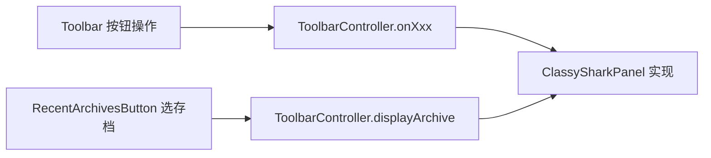

# 🧩 ToolbarController

<Badge type="tip" text="GUI 契约层" /> <Badge type="info" text="接口" />

> 中介者向工具栏公开的 8 个回调接口，让 Toolbar 与 ClassySharkPanel 解耦。

📁 源码：<code>ClassySharkWS/src/com/google/classyshark/gui/panel/toolbar/ToolbarController.java</code> &nbsp; 📦 包：<code>com.google.classyshark.gui.panel.toolbar</code>

## 职责

`ToolbarController` 是接口，定义工具栏向中央中介者回调的 8 个入口：输入框变更、打开存档、后退、查看顶级类、映射、导出、左面板显隐、设置。它 `extends ArchiveDisplayer`，强制实现方提供 `displayArchive` 能力。让 `Toolbar` 只见 8 个回调而非整个 `ClassySharkPanel`/`SilverGhost`。

## 关键方法 / 字段

| 名称 | 类型 | 说明 |
|------|------|------|
| `onChangedTextFromTypingArea(String)` | void | 输入框文本变更 |
| `openArchive()` | void | 打开存档（弹选择器） |
| `onGoBackPressed()` | void | 后退到类列表 |
| `onViewTopClassPressed()` | void | 查看顶级类 |
| `onMappingsButtonPressed()` | void | 导入 Proguard 映射 |
| `onExportButtonPressed()` | void | 导出当前类/存档 |
| `onChangeLeftPaneVisibility(boolean)` | void | 左面板显隐 |
| `onSettingsButtonPressed()` | void | 打开设置 |
| `displayArchive(File)` | 继承自 ArchiveDisplayer | 显示存档 |

## 工作流程

## 设计要点

- 🪜 **窄接口** — 只暴露 8 个语义回调，工具栏不感知中介者内部。
- 🧬 **继承 ArchiveDisplayer** — 让实现方同时是「能显示存档的对象」，最近存档按钮可注入。
- 🔗 **依赖倒置** — `Toolbar` 构造接收本接口，便于测试与替换。

## 协作关系

- 实现 ← [[ClassySharkPanel]]
- 继承 → [[ArchiveDisplayer]]
- 被调用 ← [[Toolbar]]、[[RecentArchivesButton]]

## 已知问题 / TODO

- 无明显已知问题；接口职责清晰。

## 相关文档

- [GUI 架构](/reference/architecture/gui-layer)
- [[ArchiveDisplayer]]
- [[ClassySharkPanel]]
