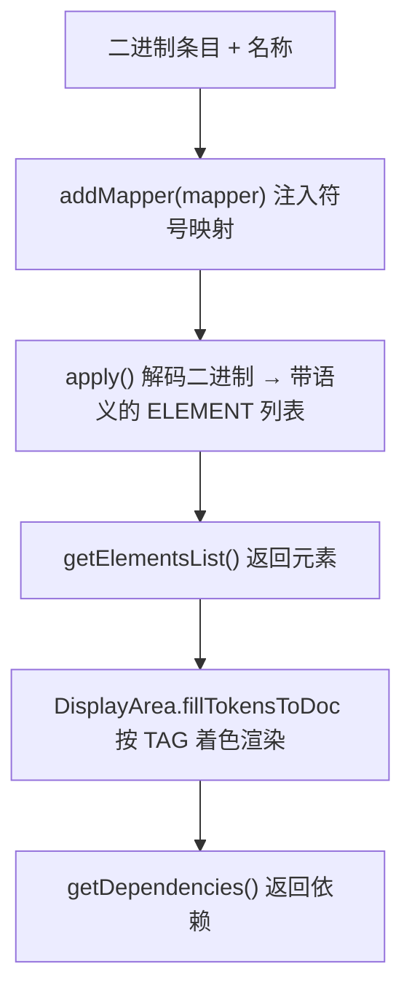

# 🧩 Translator

<Badge type="tip" text="Translator 核心" /> <Badge type="info" text="策略接口" />

> 翻译器接口：把二进制数据 + 名称，映射成带语义标签的元素列表（`<String, Tag>`）。

📁 源码：<code>ClassySharkWS/src/com/google/classyshark/silverghost/translator/Translator.java</code> &nbsp; 📦 包：<code>com.google.classyshark.silverghost.translator</code>

## 职责

`Translator` 是整个翻译子系统的根接口，注释中把它定义为一个函数：`(binary data, name) --> list of elements <String, Tag>, with human readable semantics`。每个具体翻译器（dex、xml、elf、jar、apk、java 字节码）实现该接口，把归档中的某个条目解码为一组带语义标签（`TAG`）的文本元素（`ELEMENT`），供 UI 层 `DisplayArea.fillTokensToDoc` 着色渲染。接口同时承载了 Java 与 XML 两类语义角色，使得不同格式的输出能复用同一套着色/分词机制。

## 关键方法 / 字段

| 名称 | 类型 | 说明 |
|------|------|------|
| `TAG` | enum | 语义标签：`MODIFIER, IDENTIFIER, ANNOTATION, DOCUMENT, XML_TAG, XML_ATTR_NAME, XML_ATTR_VALUE, XML_CDATA, XML_COMMENT, XML_DEFAULT, SELECTION` |
| `ELEMENT` | class | 元素 = 词 + 标签；含 `final String text` 与 `final TAG tag`，构造器 `ELEMENT(String, TAG)` |
| `getClassName()` | String | 返回当前翻译条目的名称（如 `classes.dex`、`AndroidManifest.xml`） |
| `addMapper(TokensMapper)` | void | 注入反向符号映射（如混淆名→原名）；XML/dex 等实现多为空操作 |
| `apply()` | void | 执行实际解码，填充内部元素列表 |
| `getElementsList()` | List&lt;ELEMENT&gt; | 返回解码后的带标签元素，供 UI 渲染 |
| `getDependencies()` | List&lt;String&gt; | 返回该条目依赖的其他类/库 |

## 工作流程

## 设计要点

- 🔍 **统一函数语义** — 注释明确把翻译器抽象为一个纯函数（二进制 + 名称 → 带标签元素列表），所有实现遵循同一契约。
- 🎨 **TAG 统一 Java 与 XML 语义** — 一个枚举同时容纳 Java 角色（`MODIFIER/IDENTIFIER/ANNOTATION/DOCUMENT`）与 XML 角色（`XML_TAG/XML_ATTR_NAME/XML_ATTR_VALUE/XML_CDATA/XML_COMMENT/XML_DEFAULT`），外加通用 `SELECTION`，让 UI 着色器无需区分来源格式。
- 📦 **ELEMENT 是值对象** — `text` 与 `tag` 均为 `final`，构造后不可变，便于在列表中安全传递。
- ⚙️ **addMapper 可选** — 接口允许注入 `TokensMapper` 做反混淆，但多数实现（XML、dex info、elf、jar）选择空操作，仅 Java 字节码翻译器真正消费映射。

## 协作关系

- 被调用：[[TranslatorFactory]]（按扩展名构造具体实现）
- 被调用：[[DisplayArea]]（消费 `getElementsList()` 的元素）
- 依赖：[[TokensMapper]]（`addMapper` 参数类型）

## 已知问题 / TODO

- 无明显已知问题。接口本身保持稳定，各实现的 TODO 见各自文档。

## 相关文档

- [Translator 核心架构](/reference/architecture/translator-core)
- [模块索引](/reference/modules/Main)
