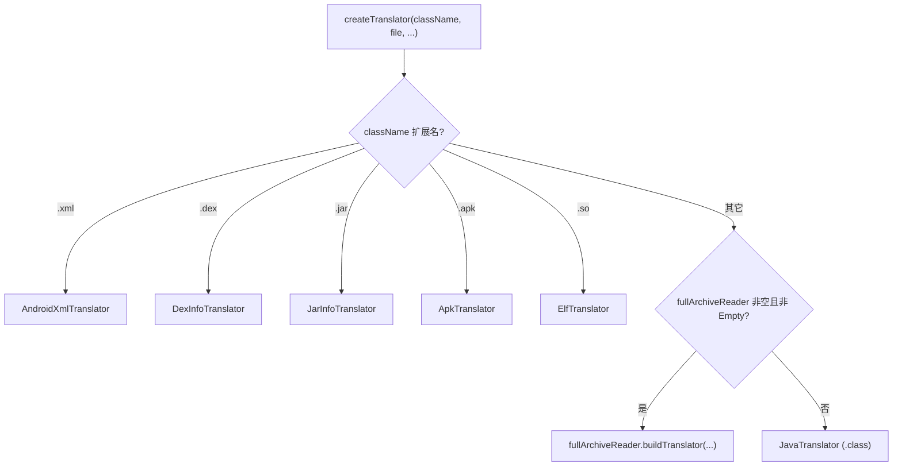

# 🧩 TranslatorFactory

<Badge type="tip" text="Translator 核心" /> <Badge type="info" text="静态工厂" />

> 按条目名称的扩展名，把请求路由到对应的 `Translator` 实现。

📁 源码：<code>ClassySharkWS/src/com/google/classyshark/silverghost/translator/TranslatorFactory.java</code> &nbsp; 📦 包：<code>com.google.classyshark.silverghost.translator</code>

## 职责

`TranslatorFactory` 是翻译子系统的静态工厂。它根据待翻译条目名称的扩展名（`.xml`/`.dex`/`.jar`/`.apk`/`.so`），new 出对应的 `Translator` 实现并返回。三个重载的 `createTranslator` 折叠为最具体的一个，缺省参数补默认值；当无扩展名匹配且传入的 `fullArchiveReader` 非空（非 `EmptyFullArchiveReader`）时，回退给插件式 `buildTranslator`；最终默认回退到 `JavaTranslator`（处理 `.class`）。

## 关键方法 / 字段

| 名称 | 类型 | 说明 |
|------|------|------|
| `createTranslator(String, File)` | static Translator | 双参重载，等价调用最具体重载（空类名列表 + null reader） |
| `createTranslator(String, File, List<String>)` | static Translator | 三参重载，传入全部类名列表（供 jar 摘要计数） |
| `createTranslator(String, File, List<String>, FullArchiveReader)` | static Translator | 最具体重载，按扩展名分发 |
| `.xml` 分支 | — | 返回 `new AndroidXmlTranslator(className, archiveFile)` |
| `.dex` 分支 | — | 返回 `new DexInfoTranslator(className, archiveFile)` |
| `.jar` 分支 | — | 返回 `new JarInfoTranslator(archiveFile, allClassNames)` |
| `.apk` 分支 | — | 返回 `new ApkTranslator(archiveFile)` |
| `.so` 分支 | — | 返回 `new ElfTranslator(className, archiveFile)` |
| 回退 1 | — | `fullArchiveReader != null && !(... instanceof EmptyFullArchiveReader)` → `fullArchiveReader.buildTranslator(...)` |
| 默认 | — | `new JavaTranslator(className, archiveFile)`（处理 `.class`） |

## 工作流程

## 设计要点

- ⚙️ **扩展名路由** — 用一连串 `endsWith` 串行匹配扩展名，简单直观，新增格式只需追加分支。
- 📦 **重载折叠** — 三个 `createTranslator` 重载都委托给四参最具体版本，缺省 `allClassNames` 用 `new LinkedList<>()`、`fullArchiveReader` 用 `null`，避免调用方重复填默认值。
- 🔌 **插件式回退** — `FullArchiveReader.buildTranslator` 提供扩展点，仅在传入的 reader 非空且非 `EmptyFullArchiveReader` 时启用，兼顾默认与插件场景。
- 🎯 **默认兜底 Java 字节码** — 无任何匹配时落到 `JavaTranslator`，假定输入是 `.class` 文件。
- ⚠️ **jar 分支遗留 TODO** — 源码注释存疑：「does it make any sense to check for jayce subvariant?」与「size does not make much sense as jayce jar may include other files beyond the code」，未解决。

## 协作关系

- 依赖：[[Translator]]（产出类型）
- 创建：[[AndroidXmlTranslator]]、[[DexInfoTranslator]]、[[JarInfoTranslator]]、[[ApkTranslator]]、[[ElfTranslator]]、[[JavaTranslator]]
- 依赖：[[FullArchiveReader]] / [[EmptyFullArchiveReader]]（插件回退）

## 已知问题 / TODO

- ⚠️ **无 `.zip` 分支** — 工厂不识别 `.zip`，但 `FileChooserUtils` 接受 `.zip`，两处不一致：用户可选 zip，但工厂找不到对应翻译器会落到 `JavaTranslator` 兜底。
- ⚠️ jar 分支遗留关于 jayce 子变体检查的未决 TODO（见上）。

## 相关文档

- [Translator 核心架构](/reference/architecture/translator-core)
- [模块索引](/reference/modules/Main)
