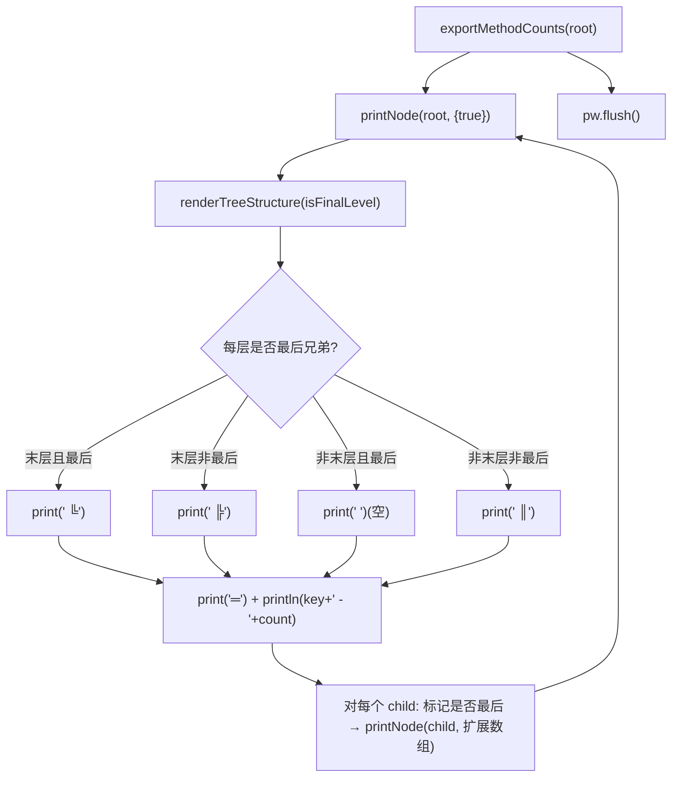

# 🧩 TreeMethodCountExporter

<Badge type="tip" text="导出器" /> <Badge type="info" text="策略实现" />

> 方法计数树的树形导出器，用 Unicode box-drawing 字符渲染带缩进的层级树。

📁 源码：<code>ClassySharkWS/src/com/google/classyshark/silverghost/exporter/TreeMethodCountExporter.java</code> &nbsp; 📦 包：<code>com.google.classyshark.silverghost.exporter</code>

## 职责

`TreeMethodCountExporter` 实现 `MethodCountExporter` 接口，以纯文本树形结构输出方法计数树。它用 Unicode 制表符（`╠` `╚` `║` `═`）渲染缩进与拐角，深度优先递归遍历 `ClassNode`，通过 `boolean[] isFinalLevel` 跟踪每一层是否为最后一个兄弟节点，据此选择"转角"还是"竖线"字符，从而画出可读性强的层级树。

## 关键方法 / 字段

| 名称 | 类型 | 说明 |
|------|------|------|
| `pw` | private PrintWriter | 输出目标 |
| `TreeMethodCountExporter(PrintWriter)` | 构造器 | 注入输出流 |
| `exportMethodCounts(ClassNode)` | void | 接口实现：从根递归 `printNode`，最后 `flush` |
| `printNode(ClassNode, boolean[])` | private void | 递归核心：渲染结构 + 打印节点 + 下钻子节点 |
| `renderTreeStructure(boolean[])` | private void | 根据 `isFinalLevel` 选 box-drawing 字符输出前缀 |

## 工作流程

## 设计要点

- 🎨 **Unicode 制表符渲染** — 用 `╚`(U+255A)、`╠`(U+2560)、`║`(U+2551)、`═`(U+2550) 画 ASCII 树，比纯空格缩进更直观。
- 📐 **boolean[] 层级状态** — `isFinalLevel[i]` 记录第 i 层当前节点是否为最后一个兄弟；末层决定拐角（`╚`/`╠`），非末层决定竖线（`║`）或空白。
- 📏 **末层补偿空格** — `renderTreeStructure` 中对非末层的"最后兄弟"情况多打一个空格，补偿 `═` 等号宽度，保持列对齐。
- 🌱 **根节点跳过渲染** — `levels.length == 1` 即根层时直接 return，根节点不画前缀，从第二层起才有结构线。
- 💧 **统一 flush** — 递归结束后 `pw.flush()` 落盘。

## 协作关系

- 实现 → [[MethodCountExporter]]（策略接口）
- 遍历 → [[ClassNode]]（通过 `getChildNodes()` 递归）
- 被调用 ← [[Exporter]]（`writeMethodCounts` 默认使用此渲染器）

## 已知问题 / TODO

- 输出依赖终端/字体对 Unicode box-drawing 字符的支持，纯 ASCII 环境可能错位。
- `renderTreeStructure` 的对齐逻辑较微妙（补偿空格条件 `i > 0` 恒真），可读性一般。

## 相关文档

- [导出器子系统](/reference/architecture/exporter)
- [方法计数子系统](/reference/architecture/methodscounter)
