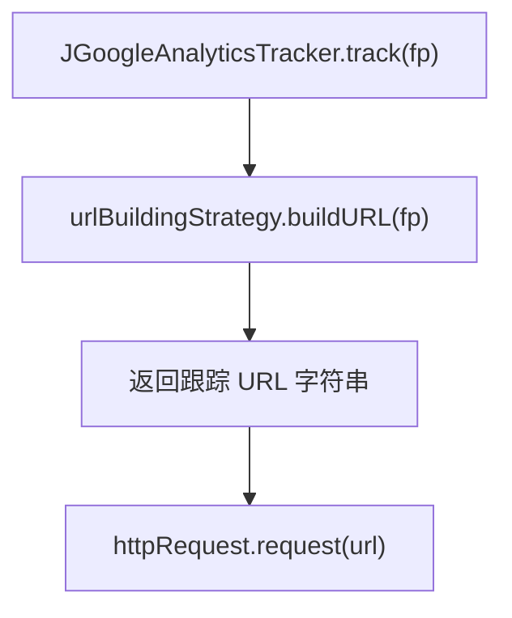

# 🧩 URLBuildingStrategy

<Badge type="tip" text="分析子系统" /> <Badge type="info" text="策略接口" />

> URL 构建策略接口：`buildURL(FocusPoint)` + `setRefererURL`，把"如何拼跟踪 URL"抽象成可替换策略。

📁 源码：<code>ClassySharkWS/src/com/google/classyshark/analytics/URLBuildingStrategy.java</code> &nbsp; 📦 包：<code>com.google.classyshark.analytics</code>

## 职责

`URLBuildingStrategy` 是分析子系统的策略模式抽象，声明 `buildURL(FocusPoint)`（把一个事件数据点转成完整的跟踪 URL）与 `setRefererURL(String)`（设置 referer）。它把"如何拼装跟踪 URL"这一可变方面从跟踪器中分离——默认实现是 GA v1 的 `GoogleAnalytics_v1_URLBuildingStrategy`，但可替换为现代 GA Measurement Protocol 或任何自研端点实现。

## 关键方法 / 字段

| 名称 | 类型 | 说明 |
|------|------|------|
| `buildURL(FocusPoint)` | String | 把事件转成跟踪 URL（抽象） |
| `setRefererURL(String)` | void | 设置 referer URL（抽象） |

## 工作流程

## 设计要点

- 🧩 **策略模式** — 把 URL 构建逻辑抽象成可替换接口，跟踪器不绑定具体协议。
- 🔌 **setter 注入** — `JGoogleAnalyticsTracker` 允许运行时替换策略。
- 📜 **历史可演进** — 默认 GA v1 实现，未来可换现代 GA 协议而跟踪器代码不变。

## 协作关系

- 实现：[[GoogleAnalytics_v1_URLBuildingStrategy]]（默认实现）
- 被调用：[[JGoogleAnalyticsTracker]]（持有并调用 buildURL）

## 已知问题 / TODO

- 无明显已知问题（极简策略接口）。

## 相关文档

- [分析子系统架构](/reference/architecture/analytics)
