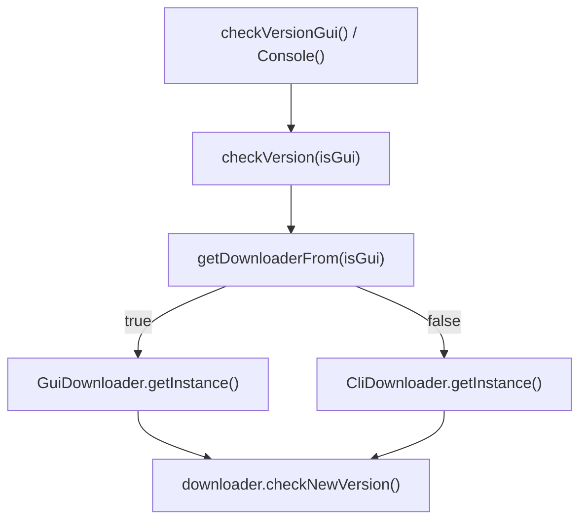

# 🧩 UpdateManager

<Badge type="tip" text="更新子系统" /> <Badge type="info" text="单例门面" />

> 单例门面：`checkVersionConsole()` / `checkVersionGui()` 两入口，按 isGui 选 GuiDownloader 或 CliDownloader。

📁 源码：<code>ClassySharkWS/src/com/google/classyshark/updater/UpdateManager.java</code> &nbsp; 📦 包：<code>com.google.classyshark.updater</code>

## 职责

`UpdateManager` 是更新子系统的单例门面，提供两个公开入口：`checkVersionConsole()`（CLI 模式）与 `checkVersionGui()`（GUI 模式）。两者都委托给私有 `checkVersion(boolean isGui)`，后者通过 `getDownloaderFrom(isGui)` 选择 `GuiDownloader` 或 `CliDownloader` 实例并调用其 `checkNewVersion()`。它以桥接模式统一了"检查并下载新版本"这一流程在两种 UI 表现（控制台 vs Swing 弹窗）下的差异。

## 关键方法 / 字段

| 名称 | 类型 | 说明 |
|------|------|------|
| `instance` | private static final UpdateManager | 单例 |
| `getInstance()` | static UpdateManager | 返回单例 |
| `checkVersionConsole()` | void | CLI 模式入口（isGui=false） |
| `checkVersionGui()` | void | GUI 模式入口（isGui=true） |
| `checkVersion(boolean)` | private void | 按 isGui 选 downloader 并 checkNewVersion |
| `getDownloaderFrom(boolean)` | private AbstractDownloader | isGui?GuiDownloader:CliDownloader |

## 工作流程

## 设计要点

- 🌉 **桥接模式** — 把"更新流程"与"UI 表现"两个维度分离，统一入口、差异实现。
- 🧩 **单例门面** — 私有构造 + 静态 instance，外部只经 `getInstance()` 访问。
- 🪶 **极简分发** — 门面本身无业务逻辑，仅按 isGui 分发到对应 downloader。

## 协作关系

- 依赖：[[AbstractDownloader]]（downloader 抽象基类）、[[GuiDownloader]]、[[CliDownloader]]
- 被调用：CLI/GUI 启动流程的版本检查入口

## 已知问题 / TODO

- 无明显已知问题（门面职责清晰）。
- 两个入口各自硬编码 isGui，无统一从运行模式自动判断的机制。

## 相关文档

- [更新子系统架构](/reference/architecture/updater)
