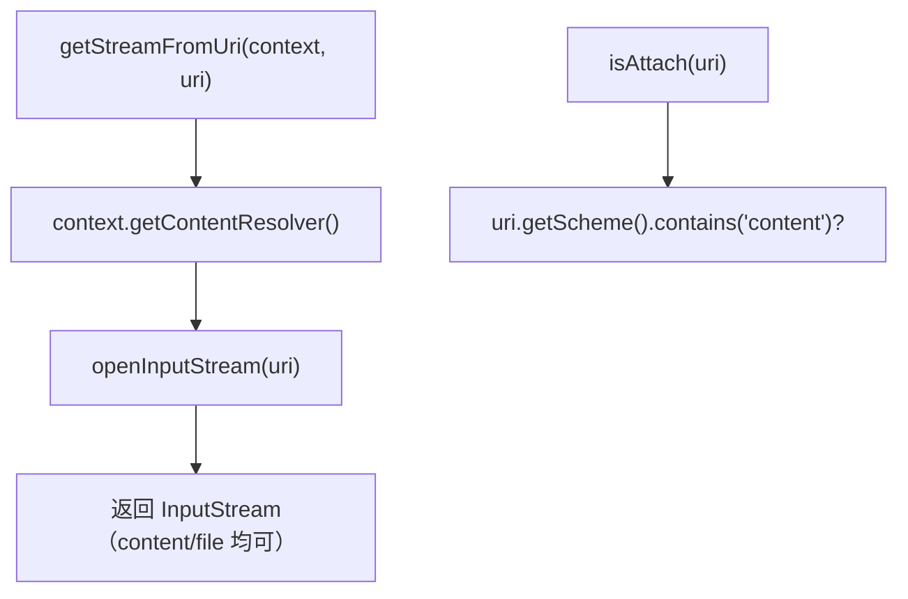

# 🧩 UriUtils

<Badge type="tip" text="Android 子系统" /> <Badge type="info" text="Uri 工具" />

> Uri 工具：`getStreamFromUri` 经 ContentResolver 开输入流，`isAttach` 判是否 content scheme——抽象 content:// 与 file:// 差异。

📁 源码：<code>ClassySharkAndroid/app/src/main/java/com/google/classysharkandroid/utils/UriUtils.java</code> &nbsp; 📦 包：<code>com.google.classysharkandroid.utils</code>

## 职责

`UriUtils` 是 ClassySharkAndroid 的 Uri 工具类。`getStreamFromUri(Context, Uri)` 经 `ContentResolver.openInputStream` 打开输入流，统一处理 `content://`（经 ContentResolver）与 `file://`（ContentResolver 同样支持）两种 scheme。`isAttach(Uri)` 判断 Uri 的 scheme 是否含 `"content"`，以区分 content scheme 与其他。它把 content:// 与 file:// 的差异抽象掉，让上层只关心拿到 InputStream。

## 关键方法 / 字段

| 名称 | 类型 | 说明 |
|------|------|------|
| `getStreamFromUri(Context, Uri)` | static InputStream | ContentResolver.openInputStream |
| `isAttach(Uri)` | static boolean | scheme 含 "content" 返 true |

## 工作流程

## 设计要点

- 🌉 **scheme 抽象** — `ContentResolver.openInputStream` 同时支持 content:// 与 file://，上层无需分支。
- 🏷️ **isAttach 判定** — 用 scheme 是否含 `"content"` 区分附件型 Uri，简单启发式。
- 🧱 **纯静态工具** — 无状态，全静态方法。
- 🧩 **统一入口** — 上层（ClassesListActivity）只调一个方法拿流，不关心 Uri 来源。

## 协作关系

- 依赖：Android `Context`/`Uri`
- 被调用：[[ClassesListActivity]]（`getStreamFromUri` 取 APK 输入流）

## 已知问题 / TODO

- `isAttach` 用 `getScheme().contains("content")` 而非 `equals`，对 `"contentx"` 等伪 scheme 也会返 true（宽松判定）。
- `getStreamFromUri` 抛 `FileNotFoundException`，调用方须自行处理（当前 ClassesListActivity 在外层 try-catch）。
- `isAttach` 在本项目代码中似乎未被调用（疑似预留/死代码）。

## 相关文档

- [Android 子系统架构](/reference/architecture/android)
