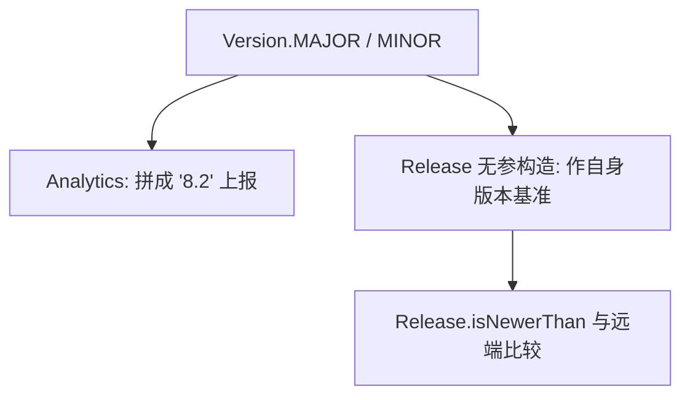

# 🧩 Version

<Badge type="tip" text="版本子系统" /> <Badge type="info" text="常量类" />

> 全局版本单一来源：`MAJOR=8`、`MINOR=2`，被 Analytics、Release 等多处引用。

📁 源码：<code>ClassySharkWS/src/com/google/classyshark/Version.java</code> &nbsp; 📦 包：<code>com.google.classyshark</code>

## 职责

`Version` 是 ClassyShark 当前版本号的常量持有者，定义 `MAJOR = 8` 与 `MINOR = 2` 两个 `public static final int`。它是全局版本信息的单一来源：`Analytics` 把 `MAJOR + "." + MINOR` 作为应用版本上报，`Release` 无参构造时用同样格式构造"自身版本"作为版本比较基准。任何需要版本号的地方都应引用这两个常量而非硬编码。

## 关键方法 / 字段

| 名称 | 类型 | 说明 |
|------|------|------|
| `MAJOR` | public static final int | `8`，主版本号 |
| `MINOR` | public static final int | `2`，次版本号 |

## 工作流程

## 设计要点

- 📍 **单一来源** — 版本号集中一处常量，避免散落各处硬编码。
- 📦 **纯常量类** — 无方法、无构造器逻辑，仅两个 final int。
- 🔗 **双角色引用** — 既供上报（Analytics），又供版本比较基准（Release）。

## 协作关系

- 依赖：无
- 被调用：[[Analytics]]（上报版本）、[[Release]]（基准版本）、[[Main]]

## 已知问题 / TODO

- 无明显已知问题（极简常量类）。
- 仅 major.minor 两段，无 patch/build 号，版本粒度较粗。

## 相关文档

- [更新子系统架构](/reference/architecture/updater)
- [分析子系统架构](/reference/architecture/analytics)
