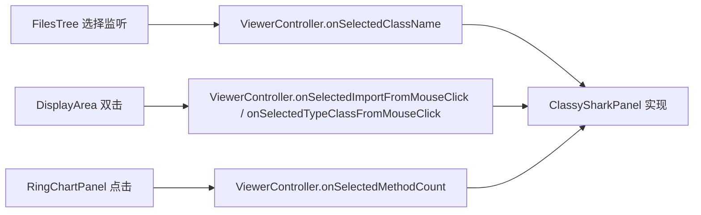

# 🧩 ViewerController

<Badge type="tip" text="GUI 契约层" /> <Badge type="info" text="接口" />

> 中介者向树/显示区/图表子视图公开的窄回调接口。

📁 源码：<code>ClassySharkWS/src/com/google/classyshark/gui/panel/ViewerController.java</code> &nbsp; 📦 包：<code>com.google.classyshark.gui.panel</code>

## 职责

`ViewerController` 是一个接口，定义了子视图（类树、显示区、环形图）向中央中介者回调的入口。它 `extends ArchiveDisplayer`，因此也强制实现方提供 `displayArchive(File)` 能力。`FilesTree`、`DisplayArea`、`RingChartPanel` 等子视图只依赖这个窄接口而非整个 `ClassySharkPanel`，从而与中介者解耦。

## 关键方法 / 字段

| 名称 | 类型 | 说明 |
|------|------|------|
| `onSelectedClassName(String)` | void | 选中某个全限定类名 |
| `onSelectedImportFromMouseClick(String)` | void | 在类源中点击 import 行 |
| `onSelectedTypeClassFromMouseClick(String)` | void | 在类源中点击某个类型词 |
| `onSelectedMethodCount(ClassNode)` | void | 选中方法计数树节点（驱动环形图） |
| `displayArchive(File)` | 继承自 ArchiveDisplayer | 显示存档（强制能力） |

## 工作流程

## 设计要点

- 🪜 **窄接口** — 只暴露 4 个语义回调，子视图不感知中介者内部结构。
- 🧬 **继承 ArchiveDisplayer** — 通过 `extends ArchiveDisplayer` 让实现方同时成为「能显示存档的对象」，拖放处理器可统一注入。
- 🔗 **依赖倒置** — `FilesTree` 等构造时接收 `ViewerController` 而非 `ClassySharkPanel`，便于测试与替换。

## 协作关系

- 实现 ← [[ClassySharkPanel]]（中央中介者实现本接口）
- 继承 → [[ArchiveDisplayer]]
- 被调用 ← [[FilesTree]]、[[DisplayArea]]、[[RingChartPanel]]

## 已知问题 / TODO

- 无明显已知问题；接口职责清晰。

## 相关文档

- [GUI 架构](/reference/architecture/gui-layer)
- [[ArchiveDisplayer]]
- [[ClassySharkPanel]]
