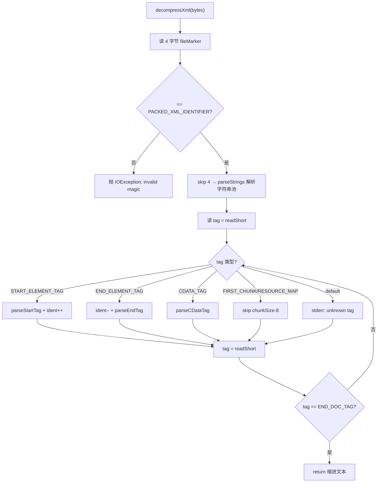

# 🧩 XmlDecompressor

<Badge type="tip" text="Translator 核心" /> <Badge type="info" text="二进制解码器" />

> 独立于 AOSP/aapt 的 Android 二进制 XML 解码器，把 `.axml` 字节流转成缩进纯文本。

📁 源码：<code>ClassySharkWS/src/com/google/classyshark/silverghost/translator/xml/XmlDecompressor.java</code> &nbsp; 📦 包：<code>com.google.classyshark.silverghost.translator.xml</code>

## 职责

`XmlDecompressor` 负责把 Android 打包后的二进制 XML（`AndroidManifest.xml` 等）解码回带缩进的纯文本。它用小端 `LittleEndianDataInputStream` 读取块类型标识（如 `PACKED_XML_IDENTIFIER=0x00080003`），先解析字符串池（支持 UTF-8 与 UTF-16LE），再遍历开始/结束元素与 CDATA 块发出缩进文本，并对类型化属性值（引用/字符串/浮点/维度/分数/int-dec/hex/boolean）做语义还原。代码源自 Ribo 的 StackOverflow 答案，并参照 AOSP `ResourceTypes.h/.cpp` 改进。

## 关键方法 / 字段

| 名称 | 类型 | 说明 |
|------|------|------|
| `PACKED_XML_IDENTIFIER` | static final int | `0x00080003`，文件魔数，校验入口 |
| `ATTRS_MARKER` | static final int | `0x00140014`，属性块起始标记 |
| `START_ELEMENT_TAG` / `END_ELEMENT_TAG` / `CDATA_TAG` / `END_DOC_TAG` | static final int | `0x0102`/`0x0103`/`0x0104`/`0x0101`，元素块类型 |
| `RES_TYPE_*` | static final int | 属性值类型常量：`REFERENCE/STRING/FLOAT/DIMENSION/FRACTION/INT_DEC/INT_HEX/INT_BOOLEAN` 等 |
| `appendNamespaces` / `appendCData` | boolean | 可配置是否输出命名空间前缀与 CDATA 块 |
| `decompressXml(byte[])` / `decompressXml(InputStream)` | String | 入口：校验魔数、解析字符串池、循环处理块直至 `END_DOC_TAG` |
| `parseStrings(DataInput)` | List&lt;String&gt; | 解析字符串池表头，按 flags 选 UTF-8/UTF-16LE |
| `parseUsingByteBuffer(...)` | List&lt;String&gt; | 用 `ByteBuffer` 小端读偏移表，逐串提取 |
| `parseStartTag` / `parseEndTag` / `parseCDataTag` | private void | 处理对应块，追加缩进文本 |
| `parseAttributes` | private void | 读 `ATTRS_MARKER`+属性数，按 `attrValueType` switch 还原值 |
| `getDimensionType` / `getFractionType` / `resValue` | static | 复数类型解析（px/dp/sp/…、%%、%%p，尾数+基数） |

## 工作流程

## 设计要点

- 🔍 **自包含、不依赖 AOSP/aapt** — 全部用 Java 内置 IO（`LittleEndianDataInputStream`、`ByteBuffer` 小端序）手写解码，无需 native 工具链。
- 🌐 **双编码支持** — 字符串池按 `flags & 0x100` 判定 UTF-8（glyphSize=1）或 UTF-16LE（glyphSize=2），并按偏移表逐串提取。
- 🎚️ **类型化属性值语义还原** — `parseAttributes` 按 `attrValueType` switch，把 `@res/0x...`、字符串、浮点、维度（px/dp/sp/pt/in/mm）、分数（%%/%%p）、十进制、十六进制、布尔等还原为人类可读形式。
- ⚙️ **可配置输出** — `appendNamespaces`（默认 false）与 `appendCData`（默认 true）让调用方控制是否输出命名空间前缀与 CDATA 块。
- 📐 **缩进与容错** — 用 160 长空格数组 `SPACE_FILL` 做缩进；遇到未知 tag 或属性标记不符时仅 `System.err` 警告，不中断解码。
- 📝 **源自 AOSP 参考** — 注释引用 `frameworks/base/include/androidfw/ResourceTypes.h` 与 `libs/androidfw/ResourceTypes.cpp` 作为改进依据。

## 协作关系

- 依赖：[[AndroidXmlTranslator]]（`apply()` 调用 `decompressXml`）
- 同包协作：[[XmlHighlighter]]（处理解压后的纯文本）

## 已知问题 / TODO

- ⚠️ 错误处理偏向容错：未知 tag、属性标记不符均只 `System.err` 打印后继续，可能产出部分失真的 XML。
- ⚠️ `parseStrings` 校验失败时复用 `ERROR_INVALID_MAGIC_NUMBER` 模板打印，错误信息文案与场景不完全匹配（提示为「invalid packed XML identifier」实为字符串表 id 不符）。

## 相关文档

- [Translator 核心架构](/reference/architecture/translator-core)
- [模块索引](/reference/modules/Main)
