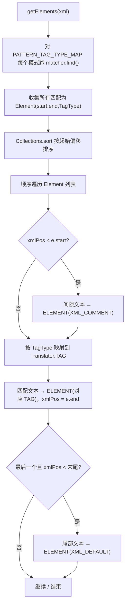

# 🧩 XmlHighlighter

<Badge type="tip" text="Translator 核心" /> <Badge type="info" text="正则分词器" />

> 用一组正则把纯文本 XML 切成带 `TAG` 标签的 `ELEMENT` 列表，供 UI 着色。

📁 源码：<code>ClassySharkWS/src/com/google/classyshark/silverghost/translator/xml/XmlHighlighter.java</code> &nbsp; 📦 包：<code>com.google.classyshark.silverghost.translator.xml</code>

## 职责

`XmlHighlighter` 接收已解压的纯文本 XML 字符串，对一组预编译正则模式逐个跑 `Matcher.find()`，收集所有匹配项为内部 `Element`（start/end/TagType），按起始偏移排序后顺序遍历：匹配项之间的间隙文本发为 `XML_COMMENT`，匹配项本身按其 `TagType` 映射到 `Translator.TAG` 发出。最终输出 `List<Translator.ELEMENT>`，供 `DisplayArea.fillTokensToDoc` 做语法着色。

## 关键方法 / 字段

| 名称 | 类型 | 说明 |
|------|------|------|
| `TagType` | enum | 内部分词类型：`TAG, ATTR_NAME, ATTR_VALUE, COMMENT, CDATA` |
| `TAG_PATTERN` / `TAG_PATTERN_2` / `TAG_END_PATTERN` | static Pattern | 匹配标签开闭（`<manifest`、`<?xml`、`>` 等） |
| `TAG_ATTRIBUTE_PATTERN` | static Pattern | 匹配属性名（`\s(\w*)\=`） |
| `TAG_ATTRIBUTE_VALUE` / `TAG_ATTRIBUTE_VALUE_2` | static Pattern | 匹配双引号/单引号属性值 |
| `TAG_COMMENT` | static Pattern | 匹配 `<!--...-->` |
| `TAG_CDATA_START` / `TAG_CDATA_END` | static Pattern | 匹配 CDATA 起止 |
| `PATTERN_TAG_TYPE_MAP` | static Map&lt;Pattern,TagType&gt; | 模式 → 标签类型映射表 |
| `Element` | static class | 内部元素，含 `start/end/tag`，实现 `Comparable`（按 start 排序） |
| `getElements(String xml)` | List&lt;ELEMENT&gt; | 主入口：跑全部正则、排序、发间隙与匹配项 |
| `main(String[])` | static void | 内置自测，打印一段样例 XML 的分词结果 |

## 工作流程

## 设计要点

- 🔍 **正则模式集中映射** — 静态 `PATTERN_TAG_TYPE_MAP` 把每个 `Pattern` 绑定一个 `TagType`，遍历一次即收集所有匹配，避免多次扫描文本。
- 📊 **按偏移排序合并** — 所有匹配项先入列表再 `Collections.sort`（`Element.compareTo` 比较 start），保证输出顺序与文本位置一致。
- 🧩 **间隙文本兜底** — 相邻匹配间的文本统一发为 `XML_COMMENT`（虽非真注释，但作为「普通文本」着色槽位），末尾剩余文本发为 `XML_DEFAULT`。
- 🔗 **双层标签** — 内部 `TagType` 与对外 `Translator.TAG` 解耦，`getElements` 末尾用 switch 把内部类型映射到接口标签。
- 🧪 **内置自测** — `main` 方法内嵌一段样例 manifest，直接打印分词结果便于人工核验。

## 协作关系

- 依赖：[[Translator]]（产出 `Translator.ELEMENT` / `Translator.TAG`）
- 被调用：[[AndroidXmlTranslator]]（`getElementsList` 委托 `getElements`）

## 已知问题 / TODO

- ⚠️ 间隙文本被统一标为 `XML_COMMENT`，语义上不精确（普通文本与注释同色），但作为着色方案可接受。
- ⚠️ `TAG_CDATA_START` 用 `.*` 至行尾匹配，跨行 CDATA 可能被截断，依赖 `Pattern.MULTILINE` 的行为。
- 无明显功能性 bug。

## 相关文档

- [Translator 核心架构](/reference/architecture/translator-core)
- [模块索引](/reference/modules/Main)
