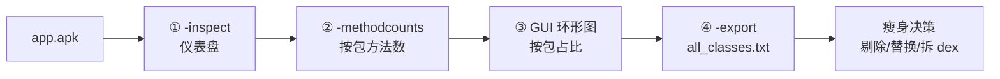

# 📐 教程：分析 APK 体积

<Badge type="tip" text="教程" /> <Badge type="info" text="APK 瘦身" />

> APK 越包越大，到底是 native 库、第三方 SDK，还是某个臃肿的包方法数爆了？本教程用 ClassyShark 的 `-inspect`、`-methodcounts`、GUI 环形图、`-export` 四步定位体积大户，全程零侵入——只读二进制，不改包。

## 适用场景

| 症状 | 本教程能回答 |
|------|-------------|
| 📦 APK 体积超阈值被商店拒 | 哪些 native 库占了大头？是否引入私有库？ |
| 🧩 不知打包进哪些三方库 | 类清单里有没有重复图片库 / 弃用库？ |
| 📊 逼近 65k 方法数上限 | 哪个包方法数最多？该不该拆 dex？ |

## 准备

```bash
# 1 份 APK + 1 个 ClassyShark.jar 即可
java -jar ClassyShark.jar -inspect app.apk
```

> 💡 `-inspect` 标注为 experimental（见 [`CliMode`](/reference/modules/CliMode) 帮助文本），输出格式随版本可能微调，但作为定位手段稳定可靠。

整体思路：CLI 量化 → GUI 定位 → 导出留证。



## 步骤一：`-inspect` 看仪表盘与 native 库

`-inspect` 把 APK 拆开，逐 dex 统计方法数、标记 native 依赖、扫描重复/弃用 Java 库、给出 Manifest 后台广播建议，打印成一张表（见 [-inspect](/cli/inspect)）。

```bash
java -jar ClassyShark.jar -inspect app.apk
```

入口 [`CliMode`](/reference/modules/CliMode) `case "-inspect"` → [`SilverGhostFacade.inspectApk`](/reference/modules/SilverGhostFacade) → [`ApkDashboard.inspect()`](/reference/modules/ApkDashboard)。输出四段：

```text
Recommendation      | Description
--------------------+----------------------------------
classes.dex         | 54231 methods
classes2.dex        | 12890 methods
Java                | Duplicate image loading libraries - picasso glide
System Broadcast   | android.intent.action.SCREEN_ON ==> .ScreenReceiver
Native Error       | libfoo.so  -- private api!
```

### 🖼️ 仪表盘读图说明

- **第 1 段（各 dex + 方法数）** — 来自 [`ClassesDexDataEntry`](/reference/modules/ClassesDexDataEntry)，`allMethods` 由 `DexBackedDexFile.getMethodCount()` 统计。多个 `classesN.dex` 说明已 multidex。
- **第 2 段（Java 重复/弃用库）** — [`JavaDependenciesInspector`](/reference/modules/JavaDependenciesInspector) 按包名子串归类：同时命中 glide+picasso → `Duplicate image loading libraries`；命中 `apache.http` → `Apache Http is deprecated`。**重复库 = 体积浪费的最常见来源**。
- **第 3 段（System Broadcast）** — [`ManifestInspector`](/reference/modules/ManifestInspector)，与体积无关，属安全建议。
- **第 4 段（Native Error）** — [`PrivateNativeLibsInspector`](/reference/modules/PrivateNativeLibsInspector) 标记的私有 native 库，库名既不在 `APIS_LIB_LIST`（libz/libc/liblog/libEGL 等公共白名单）也不在 APK 自带集合，就标 `-- private api!`。

> 🎯 体积关注点：第 1 段看总方法数是否逼近 65k；第 2 段看有没有可砍的重复库；第 4 段看 `lib/` 下是不是塞了多余 ABI 的 `.so`。

## 步骤二：`-methodcounts` 看哪个包方法多

`-inspect` 只给总数，要细分到包就用 `-methodcounts`（见 [-methodcounts](/cli/methodcounts)）。

```bash
# 树形（默认）
java -jar Classyshark.jar -methodcounts app.apk

# 扁平全限定名，方便 grep/sort 做 Top-N
java -jar ClassyShark.jar -methodcounts app.apk -flat
```

[`SilverGhostFacade.inspectPackages`](/reference/modules/SilverGhostFacade) → [`RootBuilder.fillClassesWithMethods`](/reference/modules/RootBuilder) 按扩展名分发：`.apk` 逐个解 `.dex` 走 dexlib2，`.jar` 走 BCEL，再由 [`ClassNode`](/reference/modules/ClassNode) 按包名切段递归累加。

### 🖼️ 树形输出读图说明

```
app.apk - 67121
 ╠ com - 4920
 ║  ╠ google - 1800
 ║  ╚ example - 3120
 ╠ androidx - 12300
 ╚ com.bumptech.glide - 28000
```

- 根节点 `app.apk - 67121` 为全量方法数。
- 每经过一层包段都累加，故 `com - 4920` 是其下所有类之和。
- **最大段即体积大户**——上例 `com.bumptech.glide - 28000` 占了 42%，是瘦身首砍目标。

> 📝 扁平模式前缀含根文件名（`app.apk.com.bumptech.glide - 28000`），管道 `| sort -t- -k2 -rn | head` 即得方法数 Top-N 包。

## 步骤三：GUI 环形图按包占比定位大户

数字树不够直观，GUI 的旭日环形图一眼看出占比（见 [环形图](/gui/ring-chart)）。

```bash
java -jar ClassyShark.jar -open app.apk
```

启动后看主窗口右侧底部的 [`RingChart`](/reference/modules/RingChart)。它与方法计数树共享同一棵 `ClassNode`：

- 🍩 **外环 depth=1** — 顶级包，按方法数降序取 PALETTE 9 色（蓝/橙/绿…），段角度 = `子方法数 / 根方法数 × 360°`。
- 🍩 **内环 depth=2** — 子包，用父色的 7 色渐变变体（`L2_PALLETES`），视觉上「同族同色」。
- 🗑️ **Others 段** — 尾部 < 5° 的小段合并为灰色，不可拾取。

### 🖼️ 环形图交互说明

| 操作 | 行为 |
|------|------|
| 🖱️ 鼠标悬停 | [`RingChartPanel`](/reference/modules/RingChartPanel) 调 `getClassNodeAt(x,y)`，靠 `BufferedImage.getRGB` 反查 `colorClassNodeMap`，工具提示显示 `包名: 方法数` |
| 🖱️ 点击有子节点的段 | 经 [`ViewerController`](/reference/modules/ViewerController) 把该节点推为新根，左侧 [`MethodsCountPanel`](/reference/modules/MethodsCountPanel) 以它为根重画树 |
| 🎨 选中段高亮 | `getHighlightColor` 把饱和度 ×0.7 调暗，与周围饱和段对比 |

> 🎯 用法：从外环找最大的色块 → 点进去 → 左侧树自动下钻到该包 → 再看子环 → 层层定位到具体臃肿类。蓝色段最大通常就是最大的三方 SDK。

## 步骤四：`-export` 导出 `all_classes.txt` 留证

定位完大户，导出全量类清单做留档或 diff（见 [-export](/cli/export)）。

```bash
java -jar ClassyShark.jar -export app.apk
```

[`SilverGhostFacade.exportArchive`](/reference/modules/SilverGhostFacade) → [`Exporter.writeArchive`](/reference/modules/Exporter) 落盘 5 个文件：

| 文件 | 内容 | 体积分析用途 |
|------|------|-------------|
| `all_classes.txt` | 每行一个类全限定名 | ✅ 主用：grep 三方 SDK、diff 版本间新增类 |
| `all_methods.txt` | 每行一个方法签名 | 方法级清单 |
| `all_strings.txt` | dex 字符串池（MMAP 写） | 找硬编码 URL/版本号 |
| `method_counts.txt` | 按包/类树形方法计数 | 步骤二结果的文件版 |
| `AndroidManifest.xml_dump` | 解码后的 Manifest | 看组件声明 |

```bash
# 看 glide 引了多少类
grep -c "com.bumptech.glide" all_classes.txt

# 两个版本 diff 新增类
diff old/all_classes.txt new/all_classes.txt | grep "^>"

# Top-10 方法数包
sort -t- -k2 -rn method_counts.txt | head
```

> ⚠️ `all_strings.txt` 用 `FileChannel.map` 预分配尺寸按固定行宽估算，写入异常被静默吞掉（空 `catch`），超大 dex 时文件可能不完整——见 [-export MMAP 陷阱](/cli/export#mmap-写大字符串表)。

## 收尾：瘦身决策表

把四步发现汇总成行动清单：

| 发现 | 出处 | 行动 |
|------|------|------|
| 重复图片库 picasso+glide | `-inspect` Java 段 | 砍一个 |
| `libfoo.so -- private api!` | `-inspect` Native 段 | 私有库，确认是否必要 |
| `lib/armeabi/libX.so` 等冗余 ABI | `-inspect` 遍历 `lib/` | 用 ABI splits 只留主流架构 |
| `com.bumptech.glide` 占 42% 方法 | 环形图 + `-methodcounts` | 评估替换或按需拆 dex |
| 新版本莫名多了 200 类 | `diff all_classes.txt` | 回溯构建配置 |

## 相关链接

- 命令：[-inspect](/cli/inspect) · [-methodcounts](/cli/methodcounts) · [-export](/cli/export) · [-open](/cli/open)
- 模块：[`ApkDashboard`](/reference/modules/ApkDashboard) · [`RootBuilder`](/reference/modules/RootBuilder) · [`RingChart`](/reference/modules/RingChart) · [`Exporter`](/reference/modules/Exporter)
- API：编程式访问见 [`Shark`](/reference/modules/Shark)（`getAllClassNames` / `isMultiDex` / `getAllMethods`）
- 概念：[什么是 ClassyShark](/guide/what-is-classyshark) · [快速开始](/guide/quick-start)
