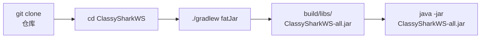

# 🏗️ 从源码构建

<Badge type="tip" text="教程" /> <Badge type="info" text="构建" />

> 本页介绍如何 clone 仓库并本地构建出可运行的 `ClassySharkWS-all.jar`（Main-Class = `com.google.classyshark.Main`）。

## 前置要求 📋

| 工具 | 版本 | 说明 |
|------|------|------|
| ☕ JDK | 1.8+ | `build.gradle` 指定 `sourceCompatibility = 1.8`，需 JDK 8 或更高 |
| 🐘 Gradle | wrapper 自带 | 仓库自带 `gradlew`，无需全局安装 |
| 🔧 Git | 任意 | 用于 clone 仓库 |

> 💡 无需 Android SDK —— 桌面端 `ClassySharkWS` 是纯 Java 工程，与 `ClassySharkAndroid`（Android Studio 工程）相互独立。

## 构建流程 🚀



### 1️⃣ 克隆仓库

```bash
git clone https://github.com/google/android-classyshark.git
cd android-classyshark
```

### 2️⃣ 进入桌面工程目录

```bash
cd ClassySharkWS
```

仓库根目录下有两个子工程：

| 子工程 | 类型 | 构建工具 | 用途 |
|--------|------|----------|------|
| 🖥️ `ClassySharkWS` | 纯 Java | Gradle（`gradlew`） | 桌面端 CLI/GUI 工具，产物为可执行 jar |
| 📱 `ClassySharkAndroid` | Android | Gradle + AGP | Android Studio 实验工程 |

桌面端构建只需进入 `ClassySharkWS/`，里面有 `build.gradle`、`gradlew`、`gradlew.bat` 和 `src/` 源码树。

### 3️⃣ 执行 fatJar 任务

```bash
./gradlew fatJar
```

`fatJar` 是 `build.gradle` 自定义的任务，把所有运行期依赖打进单个 jar：

```groovy
task fatJar(type: Jar) {
    manifest { attributes 'Main-Class': 'com.google.classyshark.Main' }
    baseName = project.name + '-all'
    from { configurations.compile.collect { it.isDirectory() ? it : zipTree(it) } }
    with jar
}
```

产物路径：

```
ClassySharkWS/build/libs/ClassySharkWS-all.jar
```

### 4️⃣ 运行验证

```bash
# GUI（无参数即进 GUI，等同 -open）
java -jar build/libs/ClassySharkWS-all.jar

# CLI：分析 APK
java -jar build/libs/ClassySharkWS-all.jar -inspect path/to/app.apk

# 查看版本
java -jar build/libs/ClassySharkWS-all.jar -update dummy.apk
```

CLI 命令详见 [CLI 参考](/cli/index)，入口分发逻辑见 [CliMode](/reference/modules/CliMode) 与 [Main](/reference/modules/Main)。

## build.gradle 关键配置 🔍

桌面端 `ClassySharkWS/build.gradle` 有三处偏离常规的配置，理解它们有助于排查构建问题。

### 源码布局：非标准 src 目录

ClassyShark 不遵循 Gradle 默认的 `src/main/java` 约定，而是把 `src/` 同时作为代码与资源根：

```groovy
sourceSets {
    main {
        java { srcDirs = ['src/'] }
        resources { srcDirs = ['src/'] }
    }
}
```

实际目录是 `src/com/google/classyshark/...`，包名 `com.google.classyshark`。`src/` 下还混放了 `resources/`、`META-INF/` 等资源，故资源也指向 `src/`。

### 依赖：flatDir + maven 混合

仓库用两种来源拼装依赖：

```groovy
repositories {
    flatDir { dirs '../third_party' }   // 本地第三方 jar
    mavenCentral()                       // 公网依赖
}
```

| 来源 | 依赖 | 作用 |
|------|------|------|
| 📁 `flatDir`（`../third_party`） | `asmdex-1.0` | 读取 DEX 注解 |
| 📁 `flatDir` | `util-2.0.6` | 二进制工具辅助 |
| 📁 `flatDir` | `java-binutils` | native 二进制解析 |
| 🌐 mavenCentral | `org.ow2.asm:asm-all:5.2` | 字节码读写 |
| 🌐 mavenCentral | `org.smali:dexlib2:2.2.7` | DEX 反汇编 |
| 🌐 mavenCentral | `org.apache.bcel:bcel:6.5.0` | 类文件分析 |
| 🌐 mavenCentral | `com.squareup.retrofit2:retrofit:2.9.0` | 自更新网络请求 |
| 🌐 mavenCentral | `com.squareup.okhttp3:okhttp:4.10.0` | HTTP 客户端 |
| 🌐 mavenCentral | `com.google.code.gson:...:2.9.0` | JSON 解析 |
| 🌐 mavenCentral | `com.google.guava:guava:31.1-jre` | 集合/缓存 |

> 📝 仓库根 `third_party/` 目录主要存放许可证文件（`ASMDEX.LICENSE`、`java-binutils.LICENSE`），对应的 jar 需自行放入该目录。完整依赖矩阵见 [依赖](/reference/architecture/dependencies)，构建系统总体设计见 [构建系统](/reference/architecture/build-system)。

### 目标字节码版本

```groovy
sourceCompatibility = 1.8
```

编译产物以 Java 8 字节码发布，兼容较老 JDK；但 `fatJar` 内含的 `guava 31.1-jre`、`okhttp 4.x` 等实际运行仍需 JDK 8+。

## 常见问题 ❓

### fatJar 报 `flatDir` 依赖找不到

`third_party/` 下缺少 `asmdex-1.0.jar` / `util-2.0.6.jar` / `java-binutils.jar`。需从原始发布包补齐，或临时注释对应 `compile name:` 行（功能会受限）。

### `./gradlew` 无执行权限

```bash
chmod +x ClassySharkWS/gradlew
```

### 想要轻量 jar（不含依赖）

用默认 `jar` 任务即可，但需配合 `Class-Path` 清单把依赖放在 `lib/` 子目录；仅 `fatJar` 是开箱即用的单文件方案。

## 进一步阅读 📚

- 🏗️ [构建系统](/reference/architecture/build-system) — Gradle 工程结构详解
- 📦 [依赖](/reference/architecture/dependencies) — 完整依赖矩阵
- 🛠️ [CLI 参考](/cli/index) — 产物 jar 的命令行用法
- 🧩 [Main 模块](/reference/modules/Main) — 程序入口分发逻辑
