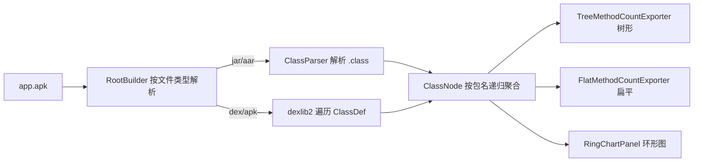

# 📊 教程：统计方法数，逼近 65k 限制

<Badge type="tip" text="教程" />
<Badge type="info" text="methodcounts" />

> Android 单个 `classes.dex` 的方法引用上限是 **65536**（65k）。当 app 引入大量三方库时，方法数会迅速逼近这条红线，触发 `TooManyClassesException` 或被迫开启 multidex。本教程用 ClassyShark 快速定位"哪个包在吃方法数"。

## 🎯 场景

你负责的 release 包方法数已到 58k，离 65k 只剩 7k 余量。PM 要求评估：哪些库是元凶、能否在不开启 multidex 的前提下瘦身。你需要按包维度把方法数拉出来排序。

## 🛠️ 工具链总览



调用入口 [`CliMode`](/reference/modules/CliMode) → `SilverGhostFacade.inspectPackages`，由 [`RootBuilder`](/reference/modules/RootBuilder) 按扩展名分发解析策略：

| 文件类型 | 解析器 | 取方法数方式 |
|----------|--------|--------------|
| `.jar` | Apache **BCEL** `ClassParser` | `JavaClass.getMethods().length` |
| `.aar` | 解压出内嵌 `.jar` → BCEL | 同上 |
| `.dex` | **dexlib2** `DexlibLoader` | 遍历 `ClassDef.getMethods()` 计数 |
| `.apk` | 解压出全部 `*.dex` → dexlib2 | 同上，逐 dex 聚合到同一棵树 |

## 步骤 1：树形查看

`-methodcounts` 默认走 [`TreeMethodCountExporter`](/reference/modules/TreeMethodCountExporter)，输出带框线的树形：

```bash
java -jar ClassyShark.jar -methodcounts app.apk
```

输出片段（用 `╠`/`╚`/`═` 渲染层级）：

```text
app.apk - 58234
═ com - 41205
═ ╠ google - 18320
═ ║ ╠ android - 9845
═ ║ ╚ gson - 4200
═ ╠ bumptech - 12010
═ ║ ╚ glide - 12010
═ org - 8030
═ ╚ apache - 8030
```

> 💡 节点显示的数字是"该包及子包方法数之和"。`ClassNode.add` 在递归每一层都累加 `methodCount`，所以根节点 = 总方法数。

## 步骤 2：扁平查看全限定名

加 `-flat` 切换到 [`FlatMethodCountExporter`](/reference/modules/FlatMethodCountExporter)，输出带点号路径的扁平列表，便于 `grep`/`sort`：

```bash
java -jar ClassyShark.jar -methodcounts app.apk -flat
```

```text
app.apk - 58234
app.apk.com - 41205
app.apk.com.google - 18320
app.apk.com.google.gson - 4200
app.apk.com.bumptech.glide - 12010
```

配合 shell 排序找 top N 包：

```bash
java -jar ClassyShark.jar -methodcounts app.apk -flat \
  | sort -t'-' -k2 -n -r | head -20
```

## 步骤 3：GUI 环形图看占比

方法数也能在 GUI 里看旭日图（[`RingChart`](/reference/modules/RingChart) + [`RingChartPanel`](/reference/modules/RingChartPanel)）：

```bash
java -jar ClassyShark.jar -open app.apk
```

打开后右侧底部环形图按包扇形占比，鼠标悬停 tooltip 显示 `包名: 方法数`，点击某扇形可下钻到子包（`RingChartPanel` 调 `viewerController.onSelectedMethodCount`）。左侧"方法计数"标签页由 [`MethodsCountPanel`](/reference/modules/MethodsCountPanel) 承载，与 CLI 共用同一棵 `ClassNode`。

## 步骤 4：导出归档

`-methodcounts` 走标准输出，`CliMode` 不直接落盘，用 shell 重定向即可：

```bash
java -jar ClassyShark.jar -methodcounts app.apk > method_counts_tree.txt
java -jar ClassyShark.jar -methodcounts app.apk -flat > method_counts_flat.txt
```

> ⚠️ 注意：`-export`（[`SilverGhostFacade.exportArchive`](/reference/modules/SilverGhostFacade)）导出的是**类清单/反编译存根**，不是方法计数。方法计数只能由 `-methodcounts` 产生，再靠重定向落盘成 `method_counts.txt`。

## 🧩 ClassNode 如何按包聚合

[`ClassNode`](/reference/modules/ClassNode) 是一棵 `Map<String, ClassNode>` 树。每个 `ClassInfo(className, methodCount` 加入时：

1. 按包名 `split("\\.")` 得到路径段数组
2. 从根节点开始，逐段查子节点，缺失则建空节点
3. **每一层都累加** `methodCount`，保证父节点 = 所有后代之和

这样根节点直接给出总方法数，任意中间包给出该包总和——正是逼近 65k 时最关心的两个数字。

## 📋 小结

| 需求 | 命令 | 输出 |
|------|------|------|
| 总览树形 | `-methodcounts app.apk` | stdout 树形 |
| 排序/grep | `-methodcounts app.apk -flat` | stdout 扁平全限定名 |
| 可视占比 | `-open app.apk` | GUI 环形图 |
| 落盘存档 | `-methodcounts ... > method_counts.txt` | 文本文件 |

下一步可读 [CLI 参考](/cli/index) 与 [-methodcounts 子命令](/cli/methodcounts)，或用 `-inspect` 看 multidex 状态。
