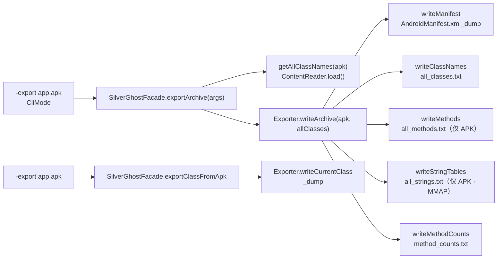

# 📦 教程：导出数据

<Badge type="tip" text="数据导出" /> <Badge type="info" text="-export · CLI" />

> 用一条 `-export app.apk` 把 APK 的 manifest、全量类名、方法、字符串、方法计数一次性落盘成纯文本文件，便于 `grep`、diff、入库做后续分析。也支持 `-export app.apk <class>` 只导出单个类的反编译 dump。

## 🎯 你将学到

- 用 `-export app.apk` 产出 5 类文本产物
- 用 `-export app.apk <class>` 导出单类 dump
- 理解 [`Exporter.writeArchive`](/reference/modules/Exporter) 串联各子步骤的流水线
- 看 `writeStringTables` 用 `FileChannel.map(MMAP)` 写大字符串表的设计取舍
- 厘清 `writeMethods` / `writeStringTables` 仅对 `.apk` 生效的边界

## 调用链总览



## 🖥️ 全量导出：一条命令五份产物

```bash
java -jar ClassyShark.jar -export app.apk
```

入口在 [`CliMode`](/reference/modules/CliMode)：首参 `-export`，`args.size() == 2` 走 `exportArchive(args)`，`args.size() == 3` 走单类导出。`exportArchive` 取 `args.get(1)` 当 APK，调 [`SilverGhostFacade.getAllClassNames`](/reference/modules/SilverGhostFacade) 读类名列表，再交给 [`Exporter.writeArchive`](/reference/modules/Exporter) 串联：

```java
// Exporter.writeArchive：五步流水线，按序写盘
writeManifest(archive);     // AndroidManifest.xml_dump
writeClassNames(allClasses); // all_classes.txt
writeMethods(archive);      // all_methods.txt（仅 APK）
writeStringTables(archive); // all_strings.txt（仅 APK）
writeMethodCounts(archive); // method_counts.txt
```

### 产物清单

| 文件 | 写入方法 | 内容 | 适用范围 |
|------|----------|------|----------|
| `AndroidManifest.xml_dump` | `writeManifest` | 解码后的明文 `AndroidManifest.xml` | 仅 `.apk` |
| `all_classes.txt` | `writeClassNames` | 全量类名（每行前置 `\n`） | 所有归档 |
| `all_methods.txt` | `writeMethods` | dex 全方法签名（`修饰符 返回 类型 名(参)`） | 仅 `.apk` |
| `all_strings.txt` | `writeStringTables` | 每个 `.dex` 的字符串表，含分节头 `classesN.dex` | 仅 `.apk` |
| `method_counts.txt` | `writeMethodCounts` | 树形包级方法计数 | 所有归档 |

> 📁 所有文件都写到当前工作目录（`new File("xxx.txt")` 相对路径），非归档旁。

## 🔍 产物细节

### `AndroidManifest.xml_dump` — 清单解码

`writeManifest` 判 `apk.getName().endsWith(".apk")`，用 [`TranslatorFactory`](/reference/modules/TranslatorFactory) 为 `"AndroidManifest.xml"` 选出二进制 XML 译码器，`translator.apply()` 后写盘，文件名取 `translator.getClassName()` 即 `AndroidManifest.xml`，加 `_dump` 后缀。

### `all_classes.txt` — 类名清单

`writeClassNames` → `writeListStrings`，遍历 `List<String>` 逐行写 `"\n" + str`。该列表由 [`SilverGhostFacade.getAllClassNames`](/reference/modules/SilverGhostFacade) → `ContentReader.load()` 产出，多 dex 也合并。`.jar` / `.aar` 同样写，是全量导出中「跨归档通用」的一步。

### `all_methods.txt` — dex 方法签名

`writeMethods` 开头即 `if (!archiveFile.getName().endsWith(".apk")) return;`，**只对 APK 产出**。委托 [`DexMethodsDumper.dumpMethods`](/reference/modules/DexMethodsDumper)：

```bash
# 样例行：修饰符 返回类型 方法名(参1,参2)
public void <init>(android.os.Bundle)
public java.lang.String toString()
```

实现用 `org.ow2.asmdex` 的 `ApplicationReader` 扫 `.dex`，`visitMethod` 里按 `access / 返回 / name(参数)` 拼字符串，dex 的 `RXYZ` 描述符经 `popReturn`/`popType`/`getDecName` 还原成 Java 类型名。

### `all_strings.txt` — dex 字符串表（MMAP 写盘）

`writeStringTables` 同样仅 APK，调 [`DexStringsDumper.dumpStrings`](/reference/modules/DexStringsDumper) 收集，再走 `writeListStringsChannel`：

```java
// Exporter.writeStringTables 的写盘路径：内存映射一次铺好容量
FileChannel rwChannel = new RandomAccessFile(to, "rw").getChannel();
ByteBuffer wrBuf = rwChannel.map(
    FileChannel.MapMode.READ_WRITE, 0, allStrings.size() * buffer.length);
for (int i = 0; i < allStrings.size(); i++) {
    wrBuf.put(allStrings.get(i).getBytes());
}
```

> ⚠️ 这里有个**真实代码的容量近似**：`buffer` 是定长 55 字节的占位行，`map` 大小按 `行数 × 55` 预分配，但循环里写的是每条真实字符串（`allStrings.get(i).getBytes()`，长度不定）。文件末尾会留出定长预估与实际写入之差的空隙。对超大 dex 字符串表，`mmap` 把写盘从「逐字节系统调用」变成「直接写映射内存」，省 `FileWriter` 的内核拷贝开销，代价是容量按固定步长粗估。读这文件做分析时注意尾部可能有空白填充。

[`DexStringsDumper`](/reference/modules/DexStringsDumper) 用 smali 的 `DexBackedDexFile` 按 `getString(i)` 顺序吐串，每个 `.dex` 前插一行分节头 `classesN.dex`。

### `method_counts.txt` — 树形方法计数

`writeMethodCounts` 固定输出树形（`TreeMethodCountExporter`），不接 `-flat` 参数。`RootBuilder.fillClassesWithMethods` 建包级树，`exportMethodCounts` 递归打印。命令行版本 `-methodcounts` 才支持 `-flat`，详见 [CLI 参考](/cli/methodcounts)。

## 📌 单类导出：dump 一个类

```bash
java -jar ClassyShark.jar -export app.apk com.bumptech.glide.request.target.BaseTarget
```

`args.size() == 3` 走 [`SilverGhostFacade.exportClassFromApk`](/reference/modules/SilverGhostFacade)：`args.get(1)` 当 APK、`args.get(2)` 当类名，[`TranslatorFactory`](/reference/modules/TranslatorFactory) 据类名选译码器（dex / jar / arr / meta），`translator.apply()` 反编译，落盘到 `<className>_dump`：

```java
// Exporter.writeCurrentClass
writeString(className + "_dump", content);
```

> 类不存在时 `translator.apply()` 抛 `NullPointerException`，被 `exportClassFromApk` 捕获并打印 `Class doesn't exist in the writeArchive`，不产文件。写盘异常则打印 `Internal error - couldn't write file`。

## 🧪 实战：批量导出后检索

```bash
# 全量导出
java -jar ClassyShark.jar -export app.apk

# 找用到某 API 的类
grep -n "android/os/Bundle" all_classes.txt

# 找潜在泄露的敏感字符串
grep -niE "token|secret|api[_-]?key" all_strings.txt

# dump 单类再 diff 两个版本
java -jar Classyshark.jar -export app-v1.apk com.example.Foo
mv com.example.Foo_dump foo-v1.txt
java -jar ClassyShark.jar -export app-v2.apk com.example.Foo
diff foo-v1.txt com.example.Foo_dump
```

## 📚 延伸阅读

- [`Exporter`](/reference/modules/Exporter) — 五步写盘流水线
- [`SilverGhostFacade`](/reference/modules/SilverGhostFacade) — `exportArchive` / `exportClassFromApk` 入口
- [`DexMethodsDumper`](/reference/modules/DexMethodsDumper) — asmdex 扫 dex 方法
- [`DexStringsDumper`](/reference/modules/DexStringsDumper) — smali 读 dex 字符串表
- [CLI 参考](/cli/index) · [-export 子页](/cli/export)
