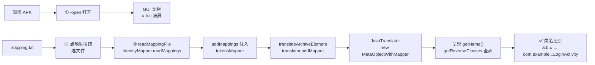
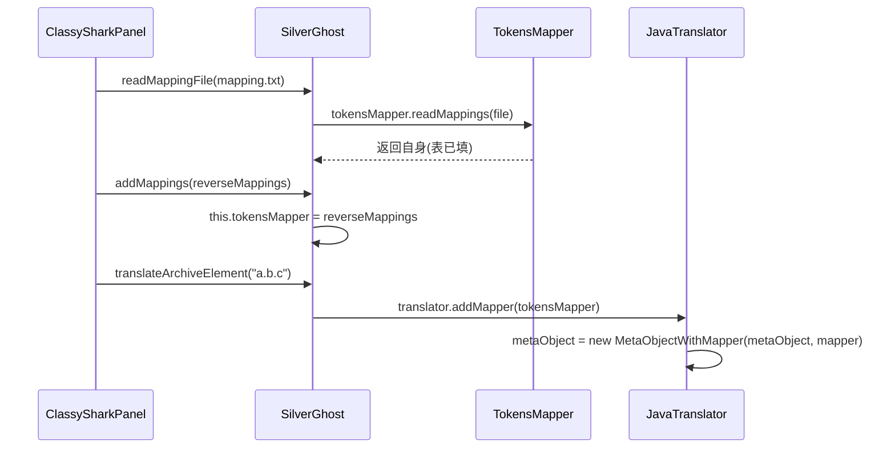

# 🗝️ 教程：反混淆 ProGuard

<Badge type="tip" text="教程" /> <Badge type="info" text="ProGuard mapping" />

> ProGuard 把 `com.example.login.LoginActivity` 压扁成 `a.b.c`，逆向分析时满屏单字母类名无从下手。本教程带你用 ClassyShark GUI 加载 `mapping.txt`，把混淆类名**实时还原**为原始名——核心是 [`SilverGhost`](/reference/modules/SilverGhost) 的 `readMappingFile → addMappings` 链路，配合 [`JavaTranslator`](/reference/modules/JavaTranslator) 用 [`MetaObjectWithMapper`](/reference/modules/MetaObjectWithMapper) 装饰元数据对象，呈现时经 `getReverseClasses()` 查表替换。

## 适用场景

| 症状 | 本教程能回答 |
|------|-------------|
| 🔤 类名全是 `a`/`b`/`c`，无法判断业务模块 | 如何用 mapping.txt 把类名还原？ |
| 🔍 想跳到 `LoginActivity` 却不知它混淆成了什么 | 还原后能否按原名检索？ |
| 🧩 三方 SDK 被混淆后看不出身份 | 能否自定义映射规则（非标准 mapping.txt）？ |

## 前置准备

| 材料 | 说明 |
|------|------|
| 📦 混淆 APK | ProGuard/R8 处理后的 release 包 |
| 📄 `mapping.txt` | 构建产物，混淆名 → 原始名的映射表 |
| 🦈 `ClassyShark.jar` | GUI 入口，反混淆**仅 GUI 支持**（CLI 无映射开关） |

> ⚠️ `mapping.txt` 是发布构建在 `<module>/build/outputs/mapping/release/mapping.txt` 生成的，反混淆必须用与 APK **同一版本**的 mapping，否则还原错位。

## 整体流程



## 步骤一：GUI 打开混淆 APK

用 `-open` 启动 GUI 并加载归档（见 [-open](/cli/open)），入口 [`CliMode`](/reference/modules/CliMode) `case "-open"`：

```bash
java -jar ClassyShark.jar -open app-release.apk
```

此时左侧类树（[`FilesTree`](/reference/modules/FilesTree)）里全是 `a` / `b` / `a.a` / `a.b` 之类的混淆名——因为 [`SilverGhost.readContents`](/reference/modules/SilverGhost) 只解析二进制取类名清单，**尚未注入任何映射**，`tokensMapper` 此时是默认的 [`IdentityMapper`](/reference/modules/IdentityMapper)（空表，原样返回）。

> 💡 类树不参与反混淆：还原只发生在右侧显示区渲染**类源码存根**时。类树节点名始终是二进制里的真实（混淆）名。

## 步骤二：点"映射"按钮加载 mapping.txt

工具栏点 **🗺️ 映射** 按钮（[`Toolbar`](/reference/modules/Toolbar)），触发 [`ClassySharkPanel.onMappingsButtonPressed`](/reference/modules/ClassySharkPanel)：

1. 弹 `JFileChooser`（目录记忆在 [`CurrentFolderConfig`](/reference/modules/CurrentFolderConfig)）。
2. 选中 `mapping.txt` → `APPROVE_OPTION` → 调 `readMappingFile(resultFile)`。

```java
// ClassySharkPanel.readMappingFile：后台线程读表，EDT 注入
SwingWorker<Void, Void> worker = new SwingWorker<>() {
    protected Void doInBackground() {
        reverseMappings = silverGhost.readMappingFile(resultFile); // ① 后台
        return null;
    }
    protected void done() {
        silverGhost.addMappings(reverseMappings);                   // ② EDT
    }
};
```

读表在 `SwingWorker` 后台线程（避免阻塞 EDT 解析大表），完成后回 EDT 调 `addMappings` 把映射器注入 `SilverGhost.tokensMapper`。

## 步骤三：映射器链路 —— readMappingFile → addMappings

这是反混淆的核心数据通路，三步在 [`SilverGhost`](/reference/modules/SilverGhost) 内完成：

| 阶段 | 方法 | 作用 |
|------|------|------|
| ① 读表 | `readMappingFile(File)` | 调当前 `tokensMapper.readMappings(file)` 解析 mapping.txt，返回自身 |
| ② 注入 | `addMappings(TokensMapper)` | 把读好的映射器赋给 `this.tokensMapper`，覆盖默认 `IdentityMapper` |
| ③ 分发 | `translateArchiveElement(name)` | 建翻译器后调 `translator.addMapper(tokensMapper)` 下发映射器 |



> 🔑 `tokensMapper` 是 **static** 字段，静态块初始化为 `IdentityMapper`，`setBinaryArchive` 也会重置回 `IdentityMapper`——所以**换 APK 后必须重新点映射按钮**，否则沿用上一份 mapping 会还原错位。

## 步骤四：MetaObjectWithMapper 装饰呈现

映射器下发到翻译器后，[`JavaTranslator.addMapper`](/reference/modules/JavaTranslator) 把内部 `MetaObject` 包成 [`MetaObjectWithMapper`](/reference/modules/MetaObjectWithMapper)：

```java
// JavaTranslator：装饰而非替换
public void addMapper(TokensMapper reverseMappings) {
    this.metaObject = new MetaObjectWithMapper(this.metaObject, reverseMappings);
}
```

这是**装饰器模式**：`MetaObjectWithMapper` 持有原 `metaObject`，构造时一次性取出 `reverseMappings.getReverseClasses()`（混淆名→原始名的 `Map`），之后只重写 `getName()`，其余方法（字段/构造器/方法/注解/接口）全部委托原对象：

```java
// 命中则替换，否则原样返回
public String getName() {
    if (reverseMappingClasses.containsKey(metaObject.getName()))
        return reverseMappingClasses.get(metaObject.getName());
    return metaObject.getName();
}
```

`apply()` 渲染存根时，类声明、包名、import 等所有取类名处都走 `getName()`，于是 `a.b.c` 在显示区里呈现为 `com.example.login.LoginActivity`。

> ⚠️ **仅类名还原**：`MetaObjectWithMapper` 只覆盖 `getName()`，**不还原方法名/字段名**——ProGuard mapping.txt 里方法/字段重命名在 ClassyShark 当前实现中保持混淆态。这是已知的范围限制。

## TokensMapper SPI：自定义映射

[`TokensMapper`](/reference/modules/TokensMapper) 是反混淆的 SPI 接口，仅两个方法：

```java
public interface TokensMapper {
    TokensMapper readMappings(File file);      // 解析映射文件，返回自身
    Map<String,String> getReverseClasses();    // 返回 混淆名→原始名 表
}
```

内置两实现：

| 实现 | 位置 | 行为 |
|------|------|------|
| [`IdentityMapper`](/reference/modules/IdentityMapper) | `silverghost.plugins` | 默认。`readMappings` 返回自身不读文件，`getReverseClasses` 返回**空 TreeMap** → 全部原样返回，即"不反混淆" |
| （自定义） | 你实现 | 解析非标准 mapping（如 R8 的 `mapping-compliant`、自家混淆方案），返回你自己的表 |

自定义 SPI 示例：

```java
public class MyR8Mapper implements TokensMapper {
    private final Map<String,String> reverse = new TreeMap<>();
    public TokensMapper readMappings(File f) {
        // 解析 R8 mapping：original -> obfuscated 方向需取反建表
        return this;
    }
    public Map<String,String> getReverseClasses() { return reverse; }
}
```

注入方式：直接 `silverGhost.addMappings(new MyR8Mapper())`，或改 `SilverGhost` 静态块默认实现。`getReverseClasses()` 返回的 **Map 是装饰器构造时一次性快照**——运行期改表不会生效，需重建 `MetaObjectWithMapper`。

## 验证还原效果

加载 mapping 后回到类树点一个混淆类（如 `a.b.c`），右侧显示区顶部类声明应变原始名：

```text
package com.example.login;

import ...

public class LoginActivity extends Activity { ... }
```

若仍显示 `a.b.c`，按顺序排查：

| 现象 | 原因 | 对策 |
|------|------|------|
| 类名没变 | mapping 与 APK 版本不匹配 | 用同版本 `mapping.txt` |
| 还原成乱码 | `mapping.txt` 编码异常 | 确认 UTF-8，去掉 BOM |
| 换 APK 后还原错位 | `tokensMapper` 沿用上次 | 重新点映射按钮 |
| 方法名仍混淆 | 设计如此，仅类名还原 | 见上文范围限制 |

## 相关链接

- 模块：[`SilverGhost`](/reference/modules/SilverGhost) · [`TokensMapper`](/reference/modules/TokensMapper) · [`MetaObjectWithMapper`](/reference/modules/MetaObjectWithMapper) · [`IdentityMapper`](/reference/modules/IdentityMapper) · [`JavaTranslator`](/reference/modules/JavaTranslator) · [`TranslatorFactory`](/reference/modules/TranslatorFactory)
- GUI：[类树导航](/gui/tree) · [显示区](/gui/display-area) · [面板布局](/gui/panels)
- 命令：[-open](/cli/open)
- 概念：[什么是 ClassyShark](/guide/what-is-classyshark) · [快速开始](/guide/quick-start) · [MetaObject 三路策略](/guide/concepts/reflect-vs-asm-vs-dexlib)
