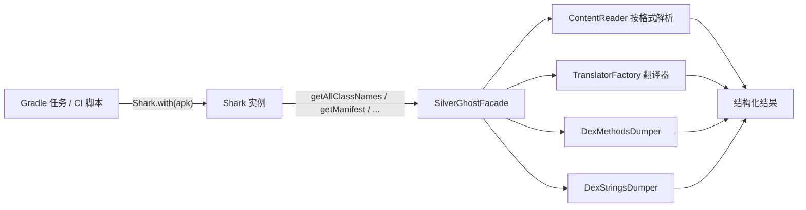

# 📚 教程：把 ClassyShark 当作库使用

<Badge type="tip" text="Shark API" /> <Badge type="info" text="构建工具链 · CI" />

> 不走 GUI、也不走 CLI，而是把 `ClassyShark.jar` 挂到 classpath 上，用 `Shark` 门面在 Gradle 任务 / Jenkins 流水线里**编程式**地读取 APK 元数据。这正是 ClassyShark 设计初衷里「面向构建与持续集成工具链」的入口。

源码参照：`Samples/SampleGradle/src/main/java/Main.java`，门面定义见 [`Shark`](/reference/modules/Shark)，API 详解见 [Shark 类详解](/api/shark-class)。

## 🎯 你将学到

- 把 `ClassyShark.jar` 作为依赖接入 Gradle 工程
- 用 `Shark.with(apk)` 绑定归档并取类名、Manifest、方法签名
- 检测 MultiDex / 自定义 DEX 加载
- 把这套分析挂到 `build` 任务后，让产物一就绪就自动跑

## 为什么用库而不是 CLI？

| 维度 | CLI（`java -jar`） | Shark API（库） |
|------|--------------------|-----------------|
| 调用方式 | 起子进程、解析 stdout 文本 | JVM 内直接调方法、拿强类型返回值 |
| 适合 | 一次性看结果、shell 脚本 | 嵌入 Gradle/Maven、CI 流水线 |
| 结果形态 | 文本输出 | `List<String>` / `boolean` / `String` |
| 入口分发 | [`CliMode`](/reference/modules/CliMode) 按参数 switch | 建造者 `Shark.with(File)` 绑定 |

> 💡 CLI 的 `-inspect`/`-methodcounts`/`-export` 与 `Shark` 最终都落到 [`SilverGhostFacade`](/reference/modules/SilverGhostFacade) 的同一套静态方法，差别只在入口。详见 [Shark 类详解](/api/shark-class)。

## 🧩 调用链



## 🛠️ 步骤 1：准备 jar 与 build.gradle

仓库的 [`Samples/SampleGradle`](https://github.com/google/android-classyshark/tree/master/Samples/SampleGradle) 用 `flatDir` 仓库把本地 `ClassyShark.jar` 当依赖引入。先把 jar 放进 `libs/`：

```text
your-project/
├── libs/
│   └── ClassyShark.jar        # 从 release 或本地构建产物拷入
└── src/main/java/Main.java
```

对应 `build.gradle`（与仓库示例等价）：

```groovy
apply plugin: 'java'
apply plugin: 'application'

repositories {
    flatDir {
        dirs 'libs'
    }
}

dependencies {
    // flatDir 引入本地 ClassyShark.jar
    compile name: 'ClassyShark'
}

sourceSets {
    main {
        java {
            srcDirs 'src/main/java'
        }
    }
}

// Main.java 位于 src/main/java/Main.java
mainClassName = "Main"
```

> ⚠️ 仓库示例用的是旧版 `compile` 配置；新 Gradle（7+）请改成 `implementation name: 'ClassyShark'`，`mainClassName` 改为 `application { mainClass = 'Main' }`。等价的现代化写法见文末。

## 📝 步骤 2：完整的 Main.java

下面是参照 `Samples/SampleGradle/src/main/java/Main.java` 整理的可运行示例，覆盖门面的全部读方法：

```java
import com.google.classyshark.Shark;
import java.io.File;

public class Main {
    public static void main(String[] args) {
        // 1. 绑定归档（示例硬编码路径，CI 里换成 args[0] 或产物路径）
        File apk =
                new File("/Users/bfarber/Desktop/Scenarios/4 APKs/"
                        + "com.google.samples.apps.iosched-333.apk");
        Shark shark = Shark.with(apk);

        // 2. 反编译单个类为伪 Java 源码
        System.out.println(
                shark.getGeneratedClass("com.bumptech.glide.request.target.BaseTarget"));

        // 3. 全量类名清单（含 .dex 条目）
        System.out.println(shark.getAllClassNames());

        // 4. AndroidManifest 明文（仅 .apk 有，否则空串）
        System.out.println(shark.getManifest());

        // 5. 所有 DEX 方法签名
        System.out.println(shark.getAllMethods());

        // 6. 汇总统计
        System.out.println("\n\n\n\nAll Classes " + shark.getAllClassNames().size() +
                "\nAll Methods " + shark.getAllMethods().size());

        // 7. MultiDex 检测（仓库 Main.java 未列，但门面已提供）
        System.out.println("isMultiDex       = " + shark.isMultiDex());
        System.out.println("isCustomMultiDex = " + shark.isCustomMultiDex());

        // 8. 字符串池（数据量大，按需开启）
        // System.out.println(shark.getAllStrings());
    }
}
```

### 方法速查

| 方法 | 返回值 | 委托 facade | 备注 |
|------|--------|------------|------|
| `with(File)` | `Shark` | — | 私有构造器唯一入口，绑定归档 |
| `getGeneratedClass(String)` | `String` | `getGeneratedClassString` | 类不存在返回空串 |
| `getAllClassNames()` | `List<String>` | `getAllClassNames` | 含 `.dex` 条目 |
| `getManifest()` | `String` | `getManifest` | 仅 `.apk`，否则 `""` |
| `getAllMethods()` | `List<String>` | `getAllMethods` | 非 APK 返回空 list |
| `getAllStrings()` | `List<String>` | `getAllStrings` | 所有字符串池，量极大 |
| `isMultiDex()` | `boolean` | `isMultiDex` | `.dex` 条目 ≥ 2 |
| `isCustomMultiDex()` | `boolean` | `isCustomMultiDex` | 含 `classes1.dex` 或非 `classes` 前缀 |

> 📌 `Shark` 只持一个 `File archiveFile`，构造器私有、无其它可变状态，是只读线程安全的。完整方法语义见 [Shark 类详解](/api/shark-class)。

## 🚀 步骤 3：跑起来

```bash
# 方式 A：用 Gradle application 插件
./gradlew run --args="path/to/app.apk"

# 方式 B：手动 java 直接带 classpath
java -cp libs/ClassyShark.jar:build/classes/java/main Main

# 方式 C：直接用 java -jar 把 ClassyShark.jar 既当库又当入口（仓库 Shark.java 自带 main）
java -cp libs/ClassyShark.jar com.google.classyshark.Shark
```

## 🏗️ 步骤 4：挂到构建工具链 / CI

真正「作为库使用」的价值，在于让分析随构建自动触发。下面是现代化 Gradle 写法，把 APK 产物喂给 `Main`：

```groovy
plugins { id 'application' }

application {
    mainClass = 'Main'
}

dependencies {
    // 新 Gradle 用 implementation；flatDir 仍是引入本地 jar 的最简方式
    implementation name: 'ClassyShark'
}

// CI 钩子：APK 一就绪就跑分析
task analyzeApk(type: JavaExec) {
    classpath = sourceSets.main.runtimeClasspath
    mainClass = 'Main'
    args = [layout.buildDirectory.file("outputs/apk/release/app-release.apk")
                .get().asFile.path]
}
build.finalizedBy analyzeApk
```

> 💡 `args[0]` 取代示例里硬编码的 `new File("...iosched-333.apk")`，让 `Main` 适配任意产物路径，CI 里即可复用。

### CI 场景对照

| 场景 | 用到的 API | 典型判断 |
|------|-----------|---------|
| 黑名单类扫描 | `getAllClassNames()` | 命中 `org.aspectj.*` 等禁用包即失败 |
| 方法数逼近 65k | `getAllMethods().size()` | > 60000 告警 |
| MultiDex 配置校验 | `isMultiDex()` / `isCustomMultiDex()` | 自动化 Dex 时应 `true` |
| Manifest 权限审计 | `getManifest()` | 解析后核对危险权限 |
| 关键类源码快照归档 | `getGeneratedClass(name)` | 写入构建产物存档 |
| 硬编码密钥扫描 | `getAllStrings()` | 关键字正则匹配 |

## ⚠️ 注意事项

- **仅 APK 有 Manifest / 方法 / 字符串**：`getManifest()`、`getAllMethods()`、`getAllStrings()` 对非 `.apk` 归档返回 `""` 或空 `LinkedList`，详见 [Shark 类详解](/api/shark-class)。
- **`getAllStrings()` 数据量极大**：大 APK 字符串池可达数十万条，CI 里务必先过滤再输出。
- **类不存在静默返回空串**：`getGeneratedClass` 内部捕获 `NullPointerException` 并打印 `Class doesn't exist in the writeArchive`，返回 `""`——空结果不等于出错。
- **依赖冲突**：`ClassyShark.jar` 自带 dexlib2 / ASM / JAXP，若宿主工程已引入同库其它版本，可能冲突；`flatDir` + `implementation` 通常足够，必要时改用 `ShadowJar` 重定位。

## 🔗 相关文档

- 模块：[Shark](/reference/modules/Shark) · [SilverGhostFacade](/reference/modules/SilverGhostFacade) · [TranslatorFactory](/reference/modules/TranslatorFactory) · [ContentReader](/reference/modules/ContentReader)
- API：[Shark 类详解](/api/shark-class) · [SilverGhostFacade](/api/silverghost-facade)
- 指南：[什么是 ClassyShark](/guide/what-is-classyshark) · [CLI 参考](/cli/index)
- 教程：[检查 AndroidManifest](/tutorials/inspect-manifest)
